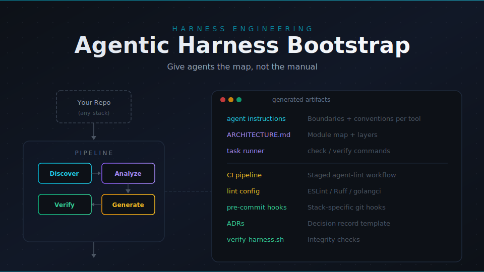

<div align="center">



# Agentic Harness Bootstrap

**Give agents the map, not the manual.**

Turn any repository into a codebase AI coding agents can safely understand, modify, and verify.

With a single prompt, generate tailored instructions, architecture maps, lint rules, pre-commit hooks, and CI scaffolding.

Compatible with Claude Code, Codex, OpenCode and GitHub Copilot workflows.

## Generates

| Artifact | Purpose |
|-|-|
| `CLAUDE.md` | Claude Code instructions — commands, conventions, boundaries |
| `AGENTS.md` | OpenAI Codex instructions — same content, Codex format |
| `.github/copilot-instructions.md` | GitHub Copilot instructions |
| `ARCHITECTURE.md` | Module map, layer diagram, dependency rules |
| Task runner (`check` / `verify`) | Composite commands for fast feedback loop and harness verification — uses your existing task runner (npm scripts, Cargo, Make, etc.) |
| Pre-commit hooks | Stack-specific git hooks (husky, pre-commit framework, GrumPHP) |
| Lint configuration | Strict linter config for your stack (ESLint, Ruff, golangci-lint, PHPStan) |
| `scripts/verify-harness.sh` | Persistent harness integrity checks |
| `docs/adr/` | ADR directory with template and first record |
| CI integration | Staged agent-lint pipeline for GitHub Actions or GitLab CI |

For **greenfield repos** (empty or new projects), it also scaffolds recommended directory structure, `.editorconfig`, and starter task runner.


[](LICENSE)
[](.github/workflows/ci.yml)
[](CONTRIBUTING.md)

</div>

---

## Quick Start

Clone this repo, open it in your AI coding tool of choice (Claude Code, Codex, GitHub Copilot, etc.), and send this prompt:

```
Bootstrap /path/to/my-project
```

Each tool automatically reads its instruction file from this repo — no flags or configuration needed. The agent runs four phases (discover → analyze → generate → verify) and writes tailored artifacts into your target project.


## How It Works

The bootstrap runs four sequential phases. Each phase produces output that the next phase consumes.

| Phase | What happens |
|-|-|
| **0 — Discover** | Scan the target repo. Detect languages, frameworks, build tools, CI config, test infrastructure. Produce a repo profile. |
| **1 — Analyze** | Deepen analysis using the repo profile. Map modules, entry points, key abstractions, and architectural patterns. |
| **2 — Generate** | Emit artifacts into the target repo using templates. Merge with existing files — never overwrite user customizations. |
| **3 — Verify** | Validate that generated files parse correctly, referenced commands work, and everything is internally consistent. |

**Brownfield repos** (existing code): The agent detects your stack, maps your architecture, and tailors artifacts to what you already have.

**Greenfield repos** (empty/new): The agent asks what you're building, then prescribes idiomatic structure, conventions, and tooling for your chosen stack.

Every generated file includes **harness evolution rules** — standing instructions that tell agents to keep the harness current as the project grows.

## The 5 Harness Engineering Principles

| # | Principle | In practice |
|-|-|-|
| 1 | **Deterministic verification** | Verify agent output with automated checks — don't trust, verify |
| 2 | **Semantic linting** | Linter messages teach agents how to fix violations in one shot |
| 3 | **Three-tier boundaries** | Every harness defines Always / Ask / Never action categories |
| 4 | **Fail-fast feedback** | Fast checks first (lint, typecheck), slow checks later (integration) |
| 5 | **Architecture as map** | `ARCHITECTURE.md` tells agents where things are, not why they exist |

See [`reference/harness-principles.md`](reference/harness-principles.md) for detailed explanations with examples.

## Examples

The `examples/` directory contains complete example outputs for three stacks:

- **[Go microservice](examples/go-service/)** — API service with standard Go project layout (`cmd/`, `internal/`, `pkg/`)
- **[PHP/Laravel](examples/php-laravel/)** — Full-stack web app with Eloquent, Blade, service layer
- **[React SPA](examples/react-app/)** — Frontend app with component architecture, Vite, Vitest

Each example shows realistic `CLAUDE.md`, `AGENTS.md`, and `ARCHITECTURE.md` files as they would be generated for a real project.

## Idempotency

The bootstrap is safe to run multiple times. Before writing any file, the agent checks if it exists. If it does, the agent reads it, preserves your customizations, and merges new sections. It never overwrites your changes.

## Repo Structure

```
agentic-harness-bootstrap/
├── CLAUDE.md                    # Bootstrap instructions for Claude Code
├── AGENTS.md                    # Bootstrap instructions for OpenAI Codex
├── ARCHITECTURE.md              # Architecture map of THIS repo
├── .github/
│   ├── copilot-instructions.md  # Bootstrap instructions for GitHub Copilot
│   └── workflows/ci.yml        # CI for this repo
├── playbooks/
│   ├── 00-discover.md           # Phase 0: Detect stack, structure, conventions
│   ├── 01-analyze.md            # Phase 1: Infer patterns, map architecture
│   ├── 02-generate.md           # Phase 2: Emit harness artifacts
│   └── 03-verify.md             # Phase 3: Validate everything works
├── templates/
│   ├── CLAUDE.md.tmpl           # Target repo Claude Code instructions
│   ├── AGENTS.md.tmpl           # Target repo Codex instructions
│   ├── copilot-instructions.md.tmpl
│   ├── ARCHITECTURE.md.tmpl     # Architecture map template
│   ├── Makefile.tmpl            # Makefile template (used when no task runner exists)
│   ├── verify-harness.sh.tmpl   # Harness verification script
│   ├── adr-template.md.tmpl     # ADR template
│   ├── pre-commit/              # Pre-commit hook templates per stack
│   ├── lint/                    # Linter config templates per stack
│   └── ci/                      # CI pipeline templates
├── scripts/
│   └── check-examples.sh        # Validates examples match template structure
├── reference/
│   ├── harness-principles.md    # The 5 harness engineering principles
│   └── lint-remediation-guide.md
└── examples/
    ├── go-service/              # Example output: Go microservice
    ├── php-laravel/             # Example output: PHP/Laravel app
    └── react-app/               # Example output: React SPA
```

## What Is Harness Engineering?

Harness engineering is the discipline of building environments, feedback loops, and control systems that enable AI agents to write reliable code at scale. Rather than hoping agents produce correct code, you build deterministic guardrails: fast linters with remediation messages, architectural maps agents can navigate, and three-tier boundaries that define what agents may always do, must ask about, or should never attempt.

This repo packages those practices into a repeatable bootstrap process that works with any AI coding tool.

## Self-Harness

This repo practices its own principles:

- **CI pipeline** (`.github/workflows/ci.yml`) validates template frontmatter, checks example integrity, and verifies instruction file synchronization on every PR
- **Example integrity** (`scripts/check-examples.sh`) ensures example outputs structurally match what templates define
- **Instruction sync** — CI verifies that `CLAUDE.md`, `AGENTS.md`, and `.github/copilot-instructions.md` have matching section structure

## Contributing

This repo is itself harness-engineered. When contributing:

1. Playbooks contain agent instructions — keep them imperative and sequential
2. Templates use `{{variable_name}}` placeholders — document all variables in YAML frontmatter
3. Reference docs are educational — explain principles, don't give commands
4. Examples must match what the templates would produce — they're ground truth
5. Run `./scripts/check-examples.sh` to verify example integrity before submitting

## Further Reading

- [Harness Engineering Principles](reference/harness-principles.md) — the five principles in depth
- [Lint Remediation Guide](reference/lint-remediation-guide.md) — configuring linters for agent-friendly output
- [ADR Template](templates/adr-template.md.tmpl) — architectural decision records
