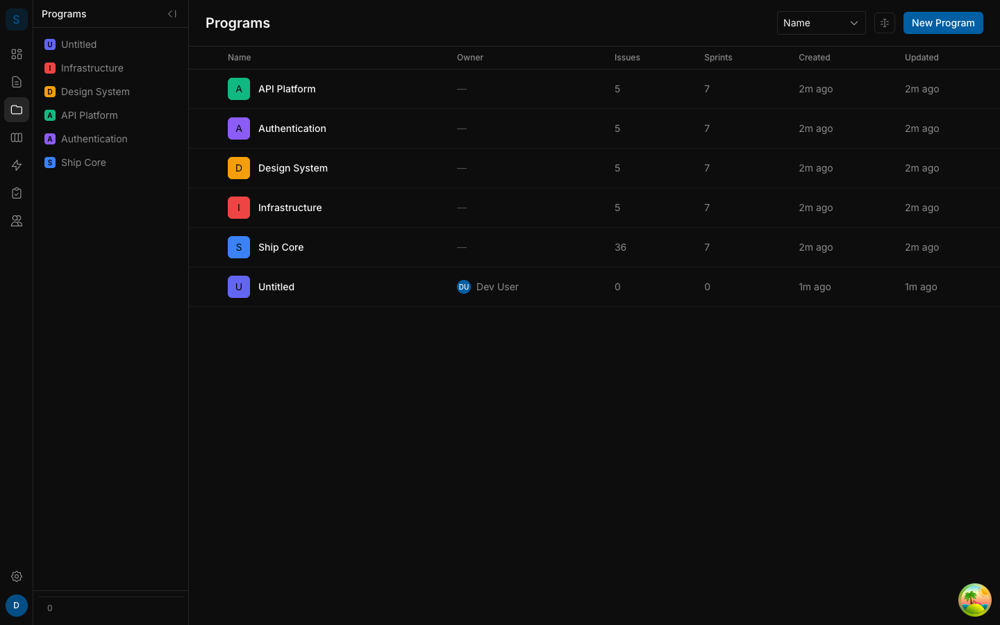
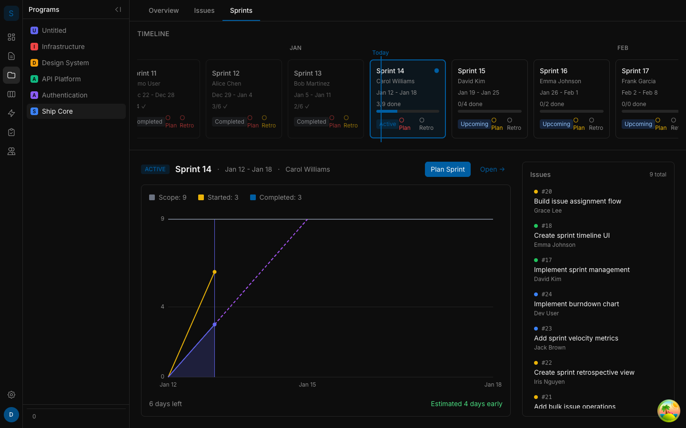
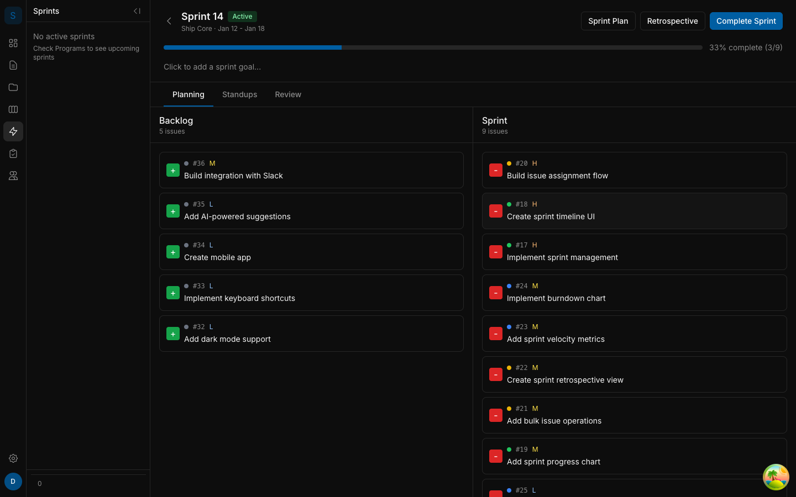
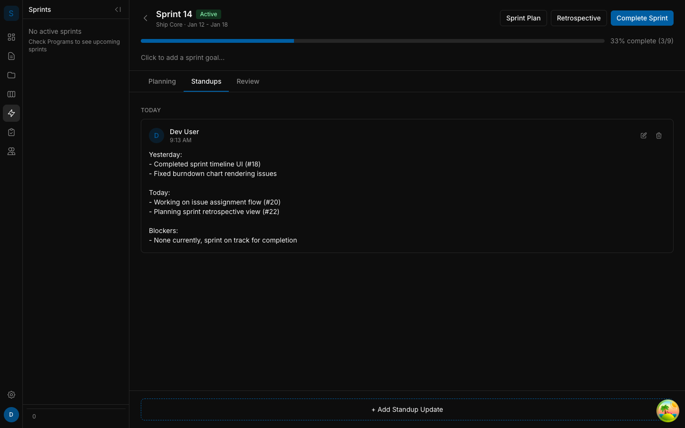
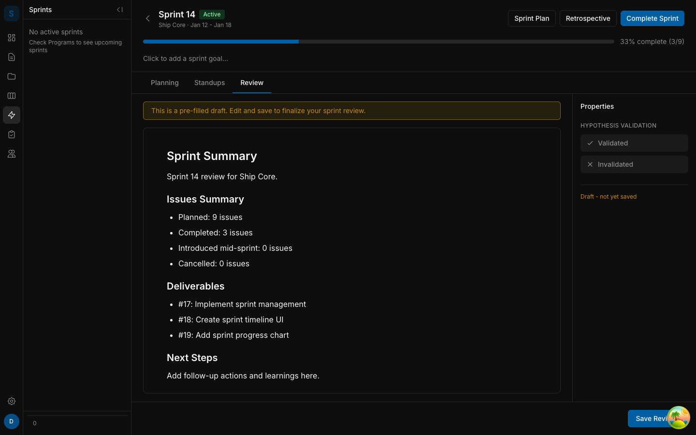
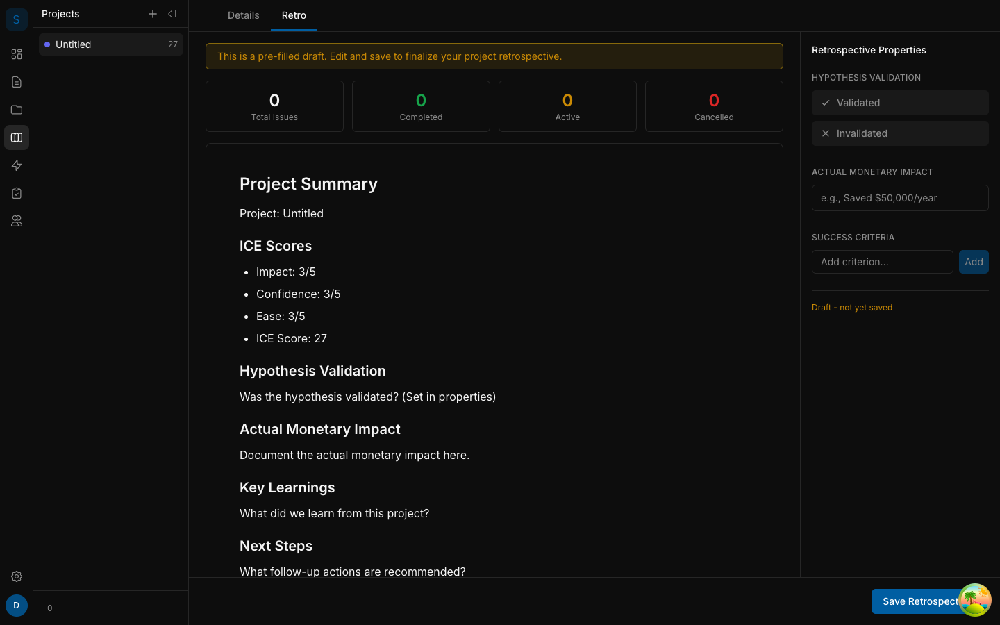
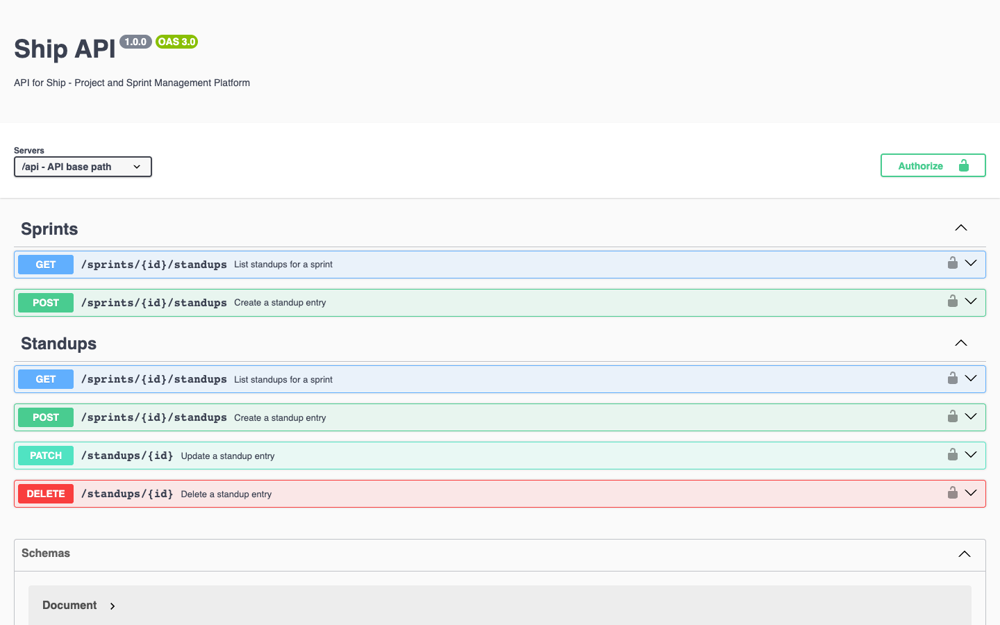

# Ship Clarity Integration - Feature Demo

**Branch:** `feature/ship-clarity-claude-integration`
**Commits:** 15+
**Lines Changed:** +6,444 / -1,302 across 26 files

---

## Overview

This branch implements the "Ship Clarity" philosophy - a systematic approach to sprint management that emphasizes hypothesis-driven development and continuous learning through structured retrospectives.

### Key Features Delivered

1. **Daily Standups** - Team members post daily updates tied to sprints
2. **Sprint Reviews** - End-of-sprint hypothesis validation
3. **Project Retrospectives** - Project-level learning capture with ICE scoring
4. **Observer Dashboard** - Cross-program visibility for leadership
5. **OpenAPI Documentation** - Interactive API explorer with Swagger UI

---

## 1. Programs List



**What it shows:**
- Multi-program organization with colorful icons
- Issue and Sprint counts per program
- Owner assignments and timestamps
- Sortable table view with customizable columns

---

## 2. Sprint Planning Timeline



**What it shows:**
- **Visual timeline** - Sprints displayed on a scrollable timeline
- **Burndown chart** - Scope, Started, and Completed issue tracking
- **Sprint cards** - Status indicators (Active, Upcoming, Completed)
- **Plan/Retro status** - Visual indicators for documentation completeness
- **Issue list** - Quick view of sprint scope on the right

---

## 3. Sprint Planning View



**What's new:**
- Three-tab interface: **Planning** | **Standups** | **Review**
- Drag issues between **Backlog** and **Sprint** columns
- Priority badges (H/M/L) for quick scanning
- Progress bar showing sprint completion percentage

---

## 4. Daily Standups



**Features:**
- Rich text updates with structured format (Yesterday/Today/Blockers)
- Author attribution with avatar and timestamps
- Date grouping ("Today", "Yesterday", specific dates)
- Edit/Delete buttons for your own standups only

**API Endpoints:**
- `GET /api/sprints/:id/standups` - List standups
- `POST /api/sprints/:id/standups` - Create standup
- `PATCH /api/standups/:id` - Update (author only)
- `DELETE /api/standups/:id` - Delete (author only)

---

## 5. Sprint Review



**Features:**
- **Pre-filled draft** - Issues automatically listed when first opened
- **Hypothesis validation toggle** - Validated/Invalidated/Not Set
- **Rich text editor** - Add narrative around the data
- **Issues summary** - Planned, Completed, Introduced, Cancelled counts
- **Deliverables list** - Completed issues with links

**API Endpoints:**
- `GET /api/sprints/:id/review` - Returns draft (is_draft: true) or saved review
- `POST /api/sprints/:id/review` - Create review (sets owner_id)
- `PATCH /api/sprints/:id/review` - Update (owner only, 403 for others)

---

## 6. Project Retrospective



**Features:**
- **Issues summary** - Total, Completed, Active, Cancelled counts
- **ICE Scores displayed** - Impact, Confidence, Ease from project setup
- **Monetary impact tracking** - Expected vs Actual
- **Hypothesis validation** - Project-level learning capture
- **Success criteria** - Add and track success metrics
- **Key learnings** - Document what the team learned
- **Next steps** - Capture follow-up actions

**API Endpoints:**
- `GET /api/projects/:id/retro` - Returns draft with pre-filled data
- `POST /api/projects/:id/retro` - Save retro
- `PATCH /api/projects/:id/retro` - Update retro

---

## 7. OpenAPI Documentation



**Features:**
- Swagger UI at `/api/docs`
- Interactive API explorer
- Try endpoints directly from browser
- Color-coded HTTP methods (GET, POST, PATCH, DELETE)

**Coverage:**
- All new endpoints documented
- Schemas for Document, Issue, Sprint, Project, Standup, SprintReview
- Request/response examples
- Error codes (403, 404, 409)

---

## Technical Highlights

### Document Model Extension

Two new document types added to unified model:
- `standup` - Daily updates (week association via document_associations, author_id)
- `sprint_review` - Week reviews (historical name; week association via document_associations, owner_id)

### Authorization Patterns

| Endpoint | Who Can Access |
|----------|---------------|
| Standup PATCH/DELETE | Author only (403 for others) |
| Sprint Review PATCH | Owner only (403 for others) |
| Project Retro PATCH | Any workspace member |

### Pre-fill Pattern

All GET endpoints return intelligent drafts:
```json
{
  "is_draft": true,
  "content": { /* pre-filled TipTap JSON */ },
  "issues_summary": { "completed": 5, "active": 2 }
}
```

After POST/PATCH, `is_draft` becomes `false`.

---

## Test Coverage

- **174 unit tests** passing
- **New test files:**
  - `api/src/routes/standups.test.ts`
  - `api/src/routes/sprint-reviews.test.ts`
  - `api/src/routes/project-retros.test.ts`

---

## UI Error Handling

All components include comprehensive error handling with toast notifications:

- **Network errors** - "Failed to load/save. Please try again."
- **Authorization errors (403)** - "You can only edit your own standups/reviews"
- **Conflict errors (409)** - "A review already exists. Refreshing..."
- **Success confirmations** - "Standup posted", "Review saved", etc.

---

## Philosophy Documentation

New docs added:
- `docs/sprint-documentation-philosophy.md` - The "why" behind this feature set

**Core principle:** Every sprint answers a hypothesis. The tooling makes capturing those learnings frictionless.
