<p align="center">
  <a href="https://github.com/US-Department-of-the-Treasury/ship">
    
  </a>
</p>

<h1 align="center">Ship</h1>

<p align="center">
  <strong>Project management that helps teams learn and improve</strong>
</p>

<p align="center">
  <a href="./LICENSE"></a>
  <a href="https://github.com/US-Department-of-the-Treasury/ship/pulls"></a>
  
  
</p>

---

## Documentation Map

Start with [docs/README.md](docs/README.md). The docs surface is organized by intent:

- `docs/core/` for living product and architecture references
- `docs/guides/` for workflow and operational guides
- `docs/assignments/fleetgraph/` for the FleetGraph PRD and working docs
  - **[FleetGraph Submission](./docs/assignments/fleetgraph/FLEETGRAPH.md)** — Agent responsibility, graph architecture, use cases, and MVP evidence
- `docs/reference/claude/` for the deeper agent-oriented codebase reference set
- `docs/research/` and `docs/solutions/` for exploratory notes and solved problems
- `docs/evidence/` and `docs/archive/` for screenshots, PR artifacts, and historical submissions

---

## Audit Submission

Start here for the reproducible audit workflow:

- Workflow page: [Audit Runner](https://github.com/thisisyoussef/ship/actions/workflows/audit-runner.yml)
- Actions runs: [All workflow runs](https://github.com/thisisyoussef/ship/actions/workflows/audit-runner.yml?query=event%3Aworkflow_dispatch)
- Latest full verified run: [Audit Runner / full-suite / master -> codex/submission-clean](https://github.com/thisisyoussef/ship/actions/runs/23119211004)
- Submission branch measured by the workflow: [`codex/submission-clean`](https://github.com/thisisyoussef/ship/tree/codex/submission-clean)
- Baseline repo used by default: [US-Department-of-the-Treasury/ship](https://github.com/US-Department-of-the-Treasury/ship)
- Latest measured SHAs: baseline `076a18371da0a09f88b5329bd59611c4bc9536bb`, submission `563581aad8ec5e445c79faa0dbc1d97869df629e`

The final audit deliverables and reproducibility entrypoints are here.

- [Written audit report](docs/archive/g4/audit-report.md)
- [Visual audit report](docs/archive/g4/audit-report-visual.html) (https://bright-follow-5f2z.pagedrop.io)
- [Discovery write-up](discovery.md)
- [GitHub Actions demo script](docs/archive/g4/final-demo-script-actions.md)
- [Discovery write-up](discovery.md) (discovery requirement)
- [AI cost analysis and reflection](docs/archive/gfa-week-4/ai-cost-log.md) (discovery requirement)
- [Improvement verification guide](docs/archive/g4/improvement-verification-guide.md)

Supporting audit evidence and charts are here:

- [Audit resources dashboard](docs/archive/g4/audit-resources/index.html)

The reproducible audit harness runs in GitHub Actions. The `Run workflow` form is prefilled for the default baseline-vs-submission comparison. Leave `run_id` and `callback_base_url` blank for a direct GitHub-only run.

### Audit Commit Tree

The audit work was intentionally split into category commits first, then reproducibility and CI/reporting commits on top. The full detailed map lives in [docs/archive/g4/commit-map.md](./docs/archive/g4/commit-map.md).

```mermaid
flowchart TD
  BASE["076a183<br/>Treasury upstream/master baseline"]

  subgraph MASTER["Canonical master category PR trail"]
    O1["Category 1 original commits<br/>bd1c3a3 week routes<br/>47cc9ca project params<br/>e8af069 issue filters<br/>f63a44f document state<br/>fdbe9d7 seed invariants<br/>c1a1d69 transformIssueLinks<br/>d4d398b accountability tests"]
    M1["7ccde92<br/>PR #3 merge"]
    O2["Category 2 original commits<br/>0299999 remove query persister<br/>d2dd4c6 lazy-load routes"]
    M2["51068df<br/>PR #4 merge"]
    O3["Category 3 original commits<br/>e39b9af documents caching<br/>fa6ec22 issues caching"]
    M3["8002425<br/>PR #6 merge"]
    O4["Category 4 original commits<br/>bf8b8e8 sprint board query collapse"]
    M4["71e4591<br/>PR #7 merge"]
    O5["Category 5 original commits<br/>f4cd8e5 tab coverage<br/>e648138 session timeout tests<br/>8753ece week route fix<br/>cb52f1f stale-data e2e<br/>824c70e collaboration regressions"]
    M5["409fe1d<br/>PR #8 merge"]
    O6["Category 6 original commits<br/>6d151e4 bootstrap noise fix<br/>7056b37 action-items modal fix<br/>afc822d error boundary recovery"]
    M6["f3bf6ed<br/>PR #9 merge"]
    O7["Category 7 original commits<br/>ed590a0 tree semantics fix<br/>b23bc3a my-week contrast fix<br/>5836099 accessibility tests"]
    M7["be396af<br/>PR #10 merge"]
    D1["6c06ab9<br/>discovery-master"]
    D2["3e9b7d8<br/>phase2-full-merge"]
    D3["ebd1dc9<br/>discovery-writeup"]
    D4["b5e8b5c<br/>heading-cleanup"]
    O1 --> M1 --> O2 --> M2 --> O3 --> M3 --> O4 --> M4 --> O5 --> M5 --> O6 --> M6 --> O7 --> M7 --> D1 --> D2 --> D3 --> D4
  end

  subgraph SUBMISSION["codex/submission-clean replay and hardening"]
    R1["Category 1 replay commits<br/>d9bee0c week routes<br/>f902e5e project params<br/>3c1e451 issue filters<br/>621fe6d document state<br/>17c113e seed invariants<br/>df4bdde transformIssueLinks<br/>083b2df accountability tests"]
    R2["Category 2 replay commits<br/>fc3506d query persister removal<br/>51e8020 lazy route loading"]
    R3["Category 3 replay commits<br/>d9accca documents caching<br/>719ceae issues caching"]
    R4["Category 4 replay commits<br/>81401e5 sprint board query collapse"]
    R5["Category 5 replay commits<br/>42a6273 tab coverage<br/>077f38e session timeout tests<br/>346f207 week route fix<br/>a2e26a2 stale-data e2e<br/>a22a0fd collaboration regressions"]
    R6["Category 6 replay commits<br/>421ac41 bootstrap noise fix<br/>c9b5a2a action-items modal fix<br/>1ffae21 error boundary recovery"]
    R7["Category 7 replay commits<br/>389a64b tree semantics fix<br/>cfd0941 my-week contrast fix<br/>5584b11 accessibility tests"]
    H1["Harness foundation<br/>b2f3900 harness + corpus<br/>a1fd5fc Render app<br/>097d6f2 methodology rewrite"]
    H2["Hosted deploy and live-master fixes<br/>a17781f Render Postgres plan<br/>a2436f5 skip git config<br/>bac9c10 live-master reproducibility"]
    H3["Hosted operator UI<br/>2b391a9 live notebook<br/>0033617 terminal autoscroll"]
    H4["Move execution to GitHub Actions<br/>a5fe025 Actions runner<br/>95ef3e5 default-branch dispatch<br/>14c188e setup progress<br/>70f4c34 artifact bundling<br/>7e941ff hosted workflow config"]
    H5["Reporting and workflow UX<br/>27ff89e accessibility operator view<br/>6f169f1 Actions README link<br/>e68c9a2 prefilled defaults<br/>83fd627 diagnostics<br/>4e18fa0 enterprise report<br/>c38fb0e split by category"]
    H6["Final reliability and docs<br/>0b5c709 gate category jobs<br/>fe9aefe dynamic matrix<br/>6a5b04c Bedrock gating<br/>8a27209 deeper reporting<br/>0c0cefd flat artifact fix<br/>8e4e075 runtime + aggregate mapping<br/>ccf5442 workflow + commit tree docs<br/>c6291c4 README reproducer wording"]
    R1 --> R2 --> R3 --> R4 --> R5 --> R6 --> R7 --> H1 --> H2 --> H3 --> H4 --> H5 --> H6
  end

  subgraph INTEGRATION["master integration and current tip"]
    I1["21d1d5a<br/>merge submission-clean"]
    I2["6abb055<br/>category history docs"]
    I3["8687aa1<br/>workflow + commit tree docs"]
    I4["9540d57<br/>merge submission-clean docs sync"]
    I5["dca71fc<br/>README reproducer wording"]
    I1 --> I2 --> I3 --> I4 --> I5
  end

  BASE --> O1
  BASE --> R1
  D4 --> I1
  H6 --> I1
```



Quick reading guide:

- `Canonical master category PR trail` shows the original isolated category branches and the master merge commits that landed them.
- `codex/submission-clean replay and hardening` shows the exact branch measured by the reproducibility workflow, including every post-category audit commit.
- `master integration and current tip` shows how the submission branch was merged back and where the README and commit-map docs landed on `master`.

What the workflow does:

- checks out the fork workflow entrypoint on `master`
- immediately checks out `codex/submission-clean` for the actual audit harness code
- runs each audit category as its own labeled GitHub Actions job
- gives every category its own logs, partial evidence bundle, and job summary
- finishes with one aggregate report job that merges all category outputs into a single readable artifact
- uploads the full evidence bundle, including `diagnostics/report.md`, `comparison.json`, `dashboard.html`, and both per-target summaries

What to look at inside a completed run:

1. `Audit scope and kickoff`
   Confirms the exact baseline repo/ref, submission repo/ref, and canonical corpus.
2. `Category 1` through `Category 7`
   Each job shows that category only, with the exact commands, logs, warnings, and uploaded evidence bundle.
3. `Aggregate final audit report`
   This job publishes the readable before/after table, the reproduction commands, `diagnostics/report.md`, `comparison.json`, and `dashboard.html`.

What the aggregate report includes:

- resolved baseline and submission SHAs
- before/after metrics for all seven categories
- exact per-category commands, not just `pnpm audit:grade`
- category-specific breakdowns such as exact failed tests for Category 5
- local reproduction commands using direct `git clone`, `pnpm install`, `pnpm build:shared`, `pnpm exec playwright install`, and `node ./scripts/audit/cli.mjs`

What you can use directly:

- open the workflow page and inspect run logs, job steps, and uploaded artifacts
- open the final aggregate job summary for the readable before/after table
- inspect any category job directly to see only that category’s commands, logs, and result
- open `diagnostics/report.md` inside the uploaded artifact for the full reproduction-oriented report
- use the hosted dashboard for the latest stored comparison output
- run the harness locally with `pnpm audit:grade`

Important note:

- viewing Actions runs and artifacts works without changing the repo
- manually clicking `Run workflow` requires repository permission on GitHub
- if you cannot trigger the workflow directly, the local one-shot command remains:

```bash
pnpm audit:grade
```

See [docs/archive/g4/improvement-verification-guide.md](./docs/archive/g4/improvement-verification-guide.md) for the exact command contract and reproduction paths, and [docs/archive/g4/commit-map.md](./docs/archive/g4/commit-map.md) for the full commit-by-commit audit history.

---

## What is Ship?

Ship is a project management tool that combines documentation, issue tracking, and plan-driven weekly workflows in one place. Instead of switching between a wiki, a task tracker, and a spreadsheet, everything lives together.

**Built by the U.S. Department of the Treasury** for government teams, but useful for any organization that wants to work more effectively.

---

## How to Use Ship

Ship has four main views, each designed for different questions:

| View         | What it answers                                                |
| ------------ | -------------------------------------------------------------- |
| **Docs**     | "Where's that document?" — Wiki-style pages for team knowledge |
| **Issues**   | "What needs to be done?" — Track tasks, bugs, and features     |
| **Projects** | "What are we building?" — Group issues into deliverables       |
| **Teams**    | "Who's doing what?" — See workload across people and weeks     |

### The Basics

1. **Create documents** for anything your team needs to remember — meeting notes, specs, onboarding guides
2. **Create issues** for work that needs to get done — assign them to people and track progress
3. **Group issues into projects** to organize related work
4. **Write weekly plans** to declare what you intend to accomplish each week

Everyone on the team can edit documents at the same time. You'll see other people's cursors as they type.

---

## The Ship Philosophy

### Everything is a Document

In Ship, there's no difference between a "wiki page" and an "issue" at the data level. They're all documents with different properties. This means:

- You can link any document to any other document
- Issues can have rich content, not just a title and description
- Projects and weeks are documents too — they can contain notes, decisions, and context

### Plans Are the Unit of Intent

Ship is plan-driven: each week starts with a written plan declaring what you intend to accomplish and ends with a retro capturing what you learned. Issues are a trailing indicator of what was done, not a leading indicator of what to do.

1. **Plan (Weekly Plan)** — Before the week, write down what you intend to accomplish and why
2. **Execute (The Week)** — Do the work; issues track what was actually done
3. **Reflect (Weekly Retro)** — After the week, write down what actually happened and what you learned

This isn't paperwork for paperwork's sake. Teams that skip retrospectives repeat the same mistakes. Teams that write things down learn and improve.

### Learning, Not Compliance

Documentation requirements in Ship are visible but not blocking. You can start a new week without finishing the last retro. But the system makes missing documentation obvious — it shows up as a visual indicator that escalates from yellow to red over time.

The goal isn't to check boxes. It's to capture what your team learned so you can get better.

---

## Getting Started

### Prerequisites

- [Node.js](https://nodejs.org/) 20 or newer
- [pnpm](https://pnpm.io/) (`npm install -g pnpm`)
- [Docker](https://www.docker.com/) (for the database)

### Setup

```bash
# 1. Clone the repository
git clone https://github.com/US-Department-of-the-Treasury/ship.git
cd ship

# 2. Install dependencies
pnpm install

# 3. Configure environment
cp api/.env.example api/.env.local
cp web/.env.example web/.env

# 4. Start the database
docker-compose up -d

# 5. Create sample data
pnpm db:seed

# 6. Run database migrations
pnpm db:migrate

# 7. Start the application
pnpm dev
```

### Open the App

Once it's running, open your browser to:

**http://localhost:5173**

Log in with the demo account:

- **Email:** `dev@ship.local`
- **Password:** `admin123`

### What's Running

| Service      | URL                                    | Description                   |
| ------------ | -------------------------------------- | ----------------------------- |
| Web app      | http://localhost:5173                  | The Ship interface            |
| API server   | http://localhost:3000                  | Backend services              |
| Swagger UI   | http://localhost:3000/api/docs         | Interactive API documentation |
| OpenAPI spec | http://localhost:3000/api/openapi.json | OpenAPI 3.0 specification     |
| PostgreSQL   | localhost:5432                         | Database (via Docker)         |

### Common Commands

```bash
pnpm dev          # Start everything
pnpm dev:web      # Start just the web app
pnpm dev:api      # Start just the API
pnpm db:seed      # Reset database with sample data
pnpm db:migrate   # Run database migrations
pnpm test         # Run tests
```

---

## Technical Details

### Architecture

Ship is a monorepo with three packages:

- **web/** — React frontend with TipTap editor for real-time collaboration
- **api/** — Express backend with WebSocket support
- **shared/** — TypeScript types used by both

### Tech Stack

| Layer     | Technology                             |
| --------- | -------------------------------------- |
| Frontend  | React, Vite, TailwindCSS               |
| Editor    | TipTap + Yjs (real-time collaboration) |
| Backend   | Express, Node.js                       |
| Database  | PostgreSQL                             |
| Real-time | WebSocket                              |

### Design Decisions

- **Everything is a document** — Single `documents` table with a `document_type` field
- **Server is truth** — Offline-tolerant, syncs when reconnected
- **Boring technology** — Well-understood tools over cutting-edge experiments
- **E2E testing** — 73+ Playwright tests covering real user flows

See [docs/core/application-architecture.md](docs/core/application-architecture.md) for more.

### Repository Structure

```
ship/
├── api/                    # Express backend
│   ├── src/
│   │   ├── routes/         # REST endpoints
│   │   ├── collaboration/  # WebSocket + Yjs sync
│   │   └── db/             # Database queries
│   └── package.json
│
├── web/                    # React frontend
│   ├── src/
│   │   ├── components/     # UI components
│   │   ├── pages/          # Route pages
│   │   └── hooks/          # Custom hooks
│   └── package.json
│
├── shared/                 # Shared TypeScript types
├── e2e/                    # Playwright E2E tests
└── docs/                   # Architecture documentation
```

---

## Testing

```bash
# Run all E2E tests
pnpm test

# Run tests with UI
pnpm test:ui

# Run specific test file
pnpm test e2e/documents.spec.ts
```

Ship uses Playwright for end-to-end testing with 73+ tests covering all major functionality.

---

## Deployment

Ship supports multiple deployment patterns:

| Environment            | Recommended Approach                                                                                                       |
| ---------------------- | -------------------------------------------------------------------------------------------------------------------------- |
| **Development**        | Local with Docker Compose                                                                                                  |
| **Railway Production** | Auto-deploy on push to `master` via GitHub Actions; manual fallback: `./scripts/deploy-railway-production.sh <commit-ish>` |
| **Staging**            | AWS Elastic Beanstalk                                                                                                      |
| **Production**         | AWS GovCloud with Terraform                                                                                                |

### Docker

```bash
# Build production images
docker build -t ship-api ./api
docker build -t ship-web ./web

# Run with Docker Compose
docker-compose -f docker-compose.prod.yml up
```

### Environment Variables

| Variable         | Description                  | Default  |
| ---------------- | ---------------------------- | -------- |
| `DATABASE_URL`   | PostgreSQL connection string | Required |
| `SESSION_SECRET` | Cookie signing secret        | Required |
| `PORT`           | API server port              | `3000`   |

Production remains AWS-native. The sanctioned Railway production environment now auto-deploys from `master` through GitHub Actions, using the checked-in `scripts/deploy-railway-production.sh` workflow and a Railway-managed public URL.

---

## Security

- **No external telemetry** — No Sentry, PostHog, or third-party analytics
- **No external CDN** — All assets served from your infrastructure
- **Session timeout** — 15-minute idle timeout (government standard)
- **Audit logging** — Track all document operations

> **Reporting Vulnerabilities:** See [SECURITY.md](./SECURITY.md) for our vulnerability disclosure policy.

---

## Accessibility

Ship is Section 508 compliant and meets WCAG 2.1 AA standards:

- All color contrasts meet 4.5:1 minimum
- Full keyboard navigation
- Screen reader support
- Visible focus indicators

---

## Contributing

We welcome contributions. See [CONTRIBUTING.md](./CONTRIBUTING.md) for guidelines.

---

## Documentation

- [Application Architecture](./docs/core/application-architecture.md) — Tech stack and design decisions
- [Unified Document Model](./docs/core/unified-document-model.md) — Data model and sync architecture
- [Document Model Conventions](./docs/core/document-model-conventions.md) — Terminology and patterns
- [Week Documentation Philosophy](./docs/core/week-documentation-philosophy.md) — Why weekly plans and retros work the way they do
- [Accountability Philosophy](./docs/core/accountability-philosophy.md) — How Ship enforces accountability
- [Accountability Manager Guide](./docs/guides/accountability-manager-guide.md) — Using approval workflows
- [FleetGraph Submission](./docs/assignments/fleetgraph/FLEETGRAPH.md) — Project intelligence agent architecture and MVP evidence
- [Full Docs Map](./docs/README.md) — Entry point for the reorganized docs tree
- [Contributing Guidelines](./CONTRIBUTING.md) — How to contribute
- [Security Policy](./SECURITY.md) — Vulnerability reporting

---

## License

[MIT License](./LICENSE)
