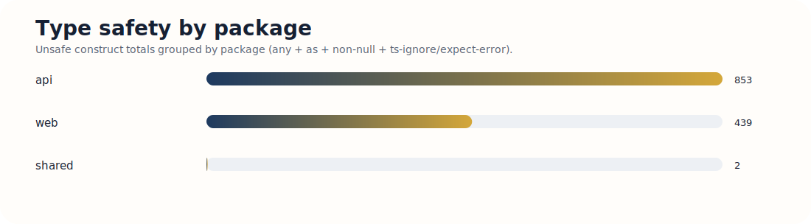
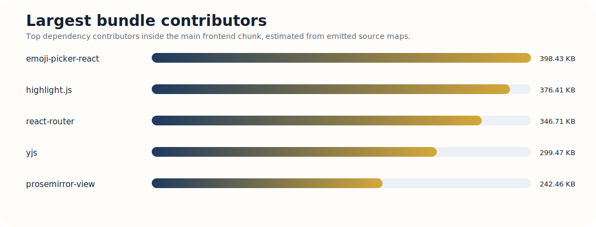
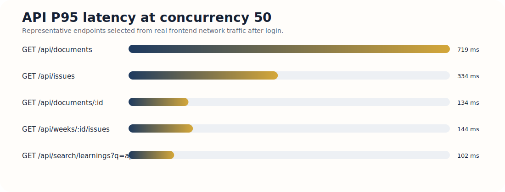
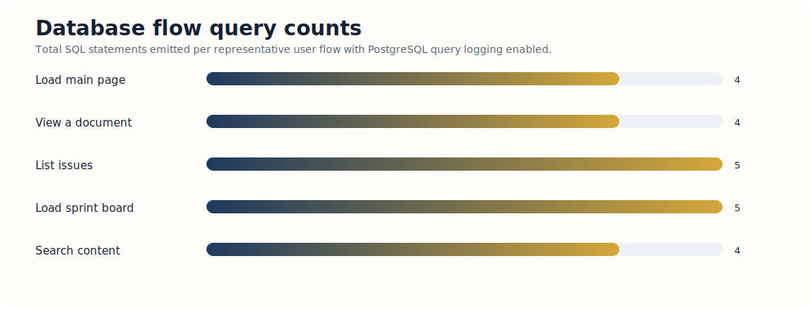
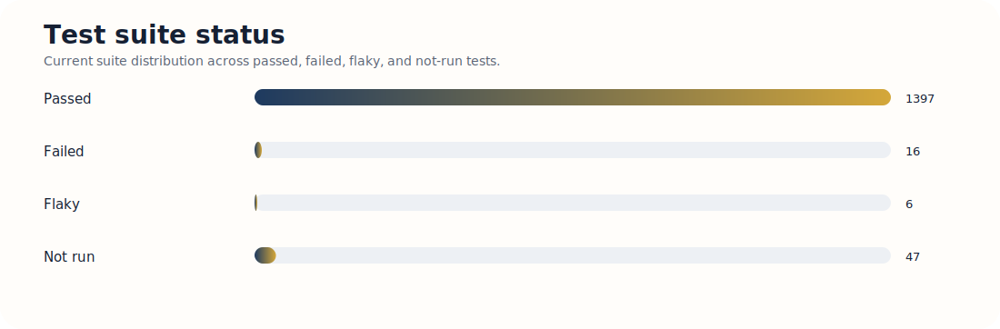
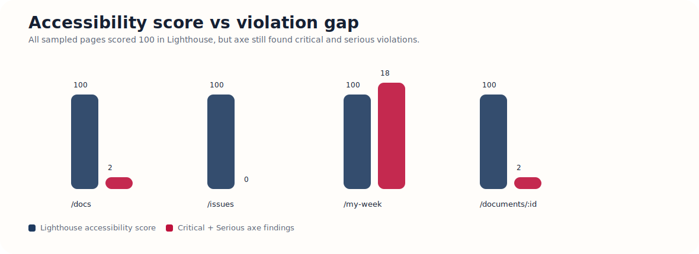

# Ship Audit Report

## Introduction

Ship is a government-oriented, Jira-like planning and execution system built on a stricter architectural premise: everything is a document. Programs, projects, weeks, issues, plans, and retros all share the same core model, with TypeScript acting as the main enforcement layer for type-specific behavior and conventions.

This report covers the 36-hour audit phase only. The goal here is diagnosis, not treatment. I did not count fixes as part of this submission. I measured the current state of the codebase across the seven required categories, recorded concrete baselines, and ranked the highest-impact weaknesses for follow-on work.

## Audit Environment

- Repository path: `/Users/youss/Development/gauntlet/ship`
- Runtime: local Docker development stack
- Stack startup command:

```bash
docker compose -f docker-compose.yml -f docker-compose.local.yml up -d
```

- Verified endpoints:
  - Web: `http://localhost:5173`
  - API docs: `http://localhost:3000/api/docs/`
  - Health: `http://localhost:3000/health`
- Seed login used for browser-authenticated measurements:
  - Email: `dev@ship.local`
  - Password: `admin123`

## Local Setup Notes

I cloned the repository locally, started Docker Desktop, and brought the app up with both compose files together:

```bash
git clone <REPO_URL> /Users/youss/Development/gauntlet/ship
cd /Users/youss/Development/gauntlet/ship
docker version
docker compose -f docker-compose.yml -f docker-compose.local.yml up -d
docker compose -f docker-compose.yml -f docker-compose.local.yml ps
curl -sS http://localhost:3000/health
curl -sS http://localhost:5173 > /tmp/ship-web.html && head -n 5 /tmp/ship-web.html
docker compose -f docker-compose.yml -f docker-compose.local.yml logs --tail 80 api web
```

What was missing or easy to miss:

- The reliable local boot command uses both `docker-compose.yml` and `docker-compose.local.yml` together.
- Compose emits a `version is obsolete` warning, but it is non-blocking.
- First startup is slower than expected because the stack pulls images and builds both `ship-api` and `ship-web`.
- Seed data runs automatically on startup and the dev credentials appear in runtime logs.
- A stale local process on port `3000` can prevent the API container from starting.
- Docker on macOS can become unstable if local storage is tight. I hit one Docker metadata cleanup edge case under `~/Library/Containers/com.docker.docker`, but it was recoverable and was not app-specific.

## Seeded Data Volume Used for Measurements

The default dev seed was not large enough for the API and database portions of the assignment, so I expanded it before benchmarking.

Baseline before supplemental seeding:

- Documents: `260`
- Issues: `105`
- Weeks (`document_type = 'sprint'`): `35`
- Users: `11`

After supplemental seeding:

- Documents: `580`
- Issues: `105`
- Weeks (`document_type = 'sprint'`): `35`
- Users: `23`

That dataset meets the assignment threshold of `500+` documents, `100+` issues, `20+` users, and `10+` weeks/sprints.

---

# Category 1: Type Safety

## 1. How I measured it

I measured type-safety violations using a TypeScript AST-based scan across `web/`, `api/`, and `shared/` rather than relying on raw grep alone. That let me count real syntax-level occurrences of:

- explicit `any`
- type assertions with `as`
- non-null assertions (`!`)
- `@ts-ignore` and `@ts-expect-error`

I also checked the repo TypeScript configuration in the root, `web`, `api`, and `shared` `tsconfig.json` files to confirm whether strict mode is enabled.

Methodology summary:

- compiler configuration review for strictness
- strict-mode count forced via CLI with `tsc --strict --noEmit`
- AST-based scan for unsafe type constructs
- package-by-package breakdown
- per-file density ranking to identify concentration points

## 2. Baseline numbers

### TypeScript configuration

- TypeScript version: `^5.7.2`
- Strict mode enabled: `Yes`
- Strict mode error count when forced via CLI with `tsc --strict --noEmit`: `0`

Because strict mode is already enabled in the repo configuration, I did not disable it in `tsconfig`. I measured the rubric’s “strict mode error count” by forcing strict mode at the compiler level across `shared`, `api`, and `web`, which returned `0` errors.

### Total violations across `web/`, `api/`, and `shared`

| Metric | Baseline |
| --- | ---: |
| Total `any` types | 273 |
| Total type assertions (`as`) | 691 |
| Total non-null assertions (`!`) | 329 |
| Total `@ts-ignore` / `@ts-expect-error` | 1 |

### Breakdown by package

| Package | `any` | `as` | `!` | `@ts-ignore` / `@ts-expect-error` |
| --- | ---: | ---: | ---: | ---: |
| `web/` | 33 | 372 | 33 | 1 |
| `api/` | 240 | 317 | 296 | 0 |
| `shared/` | 0 | 2 | 0 | 0 |

### Top 5 production files by violation density

| File | Total | Why it matters |
| --- | ---: | --- |
| `api/src/routes/weeks.ts` | 85 | Heavy use of assertions and non-null assumptions inside one of the core week/accountability routes increases risk in a key product surface. |
| `api/src/routes/projects.ts` | 51 | Project routing is central to the document model; dense unsafe typing here weakens confidence in project workflows. |
| `api/src/routes/issues.ts` | 49 | Issue creation and mutation paths are critical user flows; repeated assertions suggest types are being overridden instead of trusted. |
| `web/src/pages/UnifiedDocumentPage.tsx` | 37 | This is one of the main frontend entry points into the unified document model. A large number of assertions here makes the core page harder to reason about. |
| `api/src/db/seed.ts` | 35 | Seed code is less user-facing, but repeated non-null assertions indicate brittle assumptions in data setup and test fixtures. |

### Additional note on test density

If test files are included, the raw densest files are even more concentrated in `api` tests, especially around auth and accountability test suites. That indicates test scaffolding itself frequently bypasses the type system.

## 3. Weaknesses and opportunities

### Finding 1: The main type-safety problem is not compiler configuration; it is local bypassing of the type system

Strict mode is on, which is good, but the codebase still contains a large number of assertions and non-null assumptions. The risk is not “TypeScript is off.” The risk is “TypeScript is being overridden in hot paths.”

### Finding 2: The `api/` package is the main source of unsafe typing

`api/` contains the overwhelming majority of `any` and non-null assertions. That is the wrong place for looseness because the API layer is the system boundary between user input, auth, document logic, and the database.

### Finding 3: The `shared/` package is comparatively disciplined

`shared/` is very clean. That is important because it supports the project’s architectural premise that shared types act as the contract between frontend and backend. The problem is not the shared model itself; the problem is how often route and page code escape that model.

### Finding 4: Assertion-heavy files cluster around the most important domain flows

The densest production files are not random utilities. They are weeks, projects, issues, and the unified document page. That means the weakest type hygiene overlaps directly with the most important user workflows.

## 4. Severity ranking

| Severity | Finding | Why |
| --- | --- | --- |
| High | Unsafe typing concentrated in `api/` route handlers | Route handlers sit on the trust boundary. Failures here can produce invalid writes, null crashes, or auth/path inconsistencies. |
| High | Dense assertions in week/project/issue/document core flows | These are central product surfaces. Repeated assertions suggest brittle modeling exactly where the architecture matters most. |
| Medium | Test suites also bypass types frequently | This makes tests less trustworthy as a safety net, but the runtime risk is lower than production route code. |
| Low | `shared/` package has minimal violations | This is a strength, not a weakness. It lowers contract drift across packages. |

---

# Category 2: Bundle Size

## 1. How I measured it

I built the production frontend with Vite and sourcemaps, then measured the generated output under `web/dist/assets`. I also used the emitted sourcemap to estimate the largest dependency contributors inside the main chunk after `source-map-explorer` failed on an invalid sourcemap column.

Methodology summary:

- production build with sourcemaps
- total emitted asset size measurement
- chunk count and largest chunk extraction
- source-map-based dependency contribution analysis
- unused dependency scan in `web/`

Key command used:

```bash
pnpm --filter @ship/web exec vite build --sourcemap
```

## 2. Baseline numbers

| Metric | Baseline |
| --- | ---: |
| Total production bundle size | 10,539.29 KB |
| Largest chunk | `index-C2vAyoQ1.js` — 2,025.14 KB raw / 589.52 KB gzip |
| Number of chunks | 262 |

### Top 3 largest dependency contributors in the main chunk

These are source-map-based contribution estimates, not byte-perfect post-minification bundle slices, but they are directionally strong enough for audit purposes.

| Dependency | Estimated size contribution |
| --- | ---: |
| `emoji-picker-react` | 398.43 KB |
| `highlight.js` | 376.41 KB |
| `react-router` | 346.71 KB |

Other large contributors include `yjs`, `prosemirror-view`, `@tiptap/core`, and `lib0`, which is consistent with the app’s editor-heavy architecture.

### Unused dependencies identified in `web/`

- `@tanstack/query-sync-storage-persister`
- `@uswds/uswds`

### Unused dev dependencies identified in `web/`

- `@svgr/plugin-jsx`
- `@svgr/plugin-svgo`
- `autoprefixer`
- `postcss`
- `tailwindcss`

## 3. Weaknesses and opportunities

### Finding 1: The main JavaScript entry chunk is too large

A single frontend chunk over `2 MB` raw is the clearest bundle problem in the repo. Even with gzip, nearly `590 KB` for the main chunk is heavy for initial load.

### Finding 2: The editor and collaboration stack appear to dominate the initial bundle

That is architecturally understandable because the product is editor-centric, but it still means the most sophisticated parts of the app are likely front-loaded into the browser even when users are not actively editing.

### Finding 3: Some intended code splitting is not working as expected

The Vite build warned that some dynamic imports for editor upload components are not actually split because those modules are also statically imported elsewhere. That means the codebase is trying to split some work, but the module graph is pulling it back into the main bundle.

### Finding 4: There is at least some dead dependency weight in the frontend package

Unused dependencies are not the main bundle problem, but they are a clear cleanup opportunity and they increase maintenance surface for no product value.

## 4. Severity ranking

| Severity | Finding | Why |
| --- | --- | --- |
| High | Oversized main JS chunk | This directly affects initial load cost and first-use performance. |
| High | Editor/collaboration code likely front-loaded | The product is editor-heavy, but not every page should pay the full editor tax immediately. |
| Medium | Broken or incomplete code splitting | This is a concrete optimization opportunity with low product risk. |
| Low | Unused dependencies in `web/` | Worth cleaning up, but secondary compared to the main chunk size problem. |

---

# Category 3: API Response Time

## 1. How I measured it

I first expanded the dataset so that the backend was not being measured against a toy dev seed. I then identified real frontend API traffic by logging in through the browser and tracing network requests during common user flows.

From that trace I selected five representative endpoints:

1. `GET /api/documents`
2. `GET /api/issues`
3. `GET /api/documents/:id`
4. `GET /api/weeks/:id/issues`
5. `GET /api/search/learnings?q=api`

I authenticated using the seeded browser session and benchmarked each endpoint at `10`, `25`, and `50` concurrent connections. Early `autocannon` runs were invalidated by the dev rate limiter, so I switched to restart-isolated `ab` runs for clean baselines.

Methodology summary:

- expand seed volume to realistic scale
- trace real frontend API usage
- benchmark representative endpoints under `10`, `25`, and `50` concurrency
- record `P50`, `P95`, and `P99`
- restart the API between runs to avoid rate-limit contamination

## 2. Baseline numbers

### Endpoint benchmarks at concurrency 10 / 25 / 50

#### 1. `GET /api/documents`

| Concurrency | P50 | P95 | P99 |
| --- | ---: | ---: | ---: |
| 10 | 125 ms | 181 ms | 213 ms |
| 25 | 288 ms | 407 ms | 452 ms |
| 50 | 612 ms | 719 ms | 744 ms |

#### 2. `GET /api/issues`

| Concurrency | P50 | P95 | P99 |
| --- | ---: | ---: | ---: |
| 10 | 42 ms | 65 ms | 85 ms |
| 25 | 108 ms | 158 ms | 178 ms |
| 50 | 233 ms | 334 ms | 354 ms |

#### 3. `GET /api/documents/:id`

| Concurrency | P50 | P95 | P99 |
| --- | ---: | ---: | ---: |
| 10 | 19 ms | 27 ms | 50 ms |
| 25 | 52 ms | 85 ms | 97 ms |
| 50 | 92 ms | 134 ms | 154 ms |

#### 4. `GET /api/weeks/:id/issues`

| Concurrency | P50 | P95 | P99 |
| --- | ---: | ---: | ---: |
| 10 | 20 ms | 38 ms | 60 ms |
| 25 | 52 ms | 100 ms | 117 ms |
| 50 | 104 ms | 144 ms | 161 ms |

#### 5. `GET /api/search/learnings?q=api`

| Concurrency | P50 | P95 | P99 |
| --- | ---: | ---: | ---: |
| 10 | 15 ms | 24 ms | 56 ms |
| 25 | 37 ms | 81 ms | 92 ms |
| 50 | 74 ms | 102 ms | 136 ms |

## 3. Weaknesses and opportunities

### Finding 1: `GET /api/documents` is the clearest backend hot path

The documents list endpoint is the slowest audited route by a wide margin. At concurrency `50`, its `P95` reaches `719 ms`. That is the main response-time issue in the current baseline.

### Finding 2: The unified document model is fast enough for targeted reads, but heavier for broad list views

Single-document fetches are relatively fast. Search is also reasonably strong. The pain appears when the app has to retrieve and sort a wide visible slice of the document graph rather than one targeted document.

### Finding 3: Issue and week endpoints are acceptable but not cheap under load

`GET /api/issues` and `GET /api/weeks/:id/issues` remain below the document list endpoint, but both show visible tail growth at `50` concurrent connections.

### Finding 4: Development-only rate limiting can distort naive benchmark runs

The app’s dev environment rate limiter is strict enough that high-throughput load testing produces `429` responses unless the benchmark is controlled carefully. That is not itself an application bug, but it is a measurement hazard and matters when interpreting local benchmarks.

## 4. Severity ranking

| Severity | Finding | Why |
| --- | --- | --- |
| High | `GET /api/documents` has the weakest tail latency | It supports a core navigation flow and degrades significantly as concurrency increases. |
| Medium | Issue and week list endpoints show moderate tail growth | These are important flows, but they remain materially faster than the document list path. |
| Low | Search and document detail reads are comparatively healthy | These are not the immediate performance bottlenecks. |
| Low | Dev rate limiting complicates measurement | This matters for audit accuracy, but it is not itself a user-facing production bottleneck. |

---

# Category 4: Database Query Efficiency

## 1. How I measured it

I enabled PostgreSQL query logging and duration logging, then exercised five representative user flows through the real HTTP endpoints:

- load main page
- view a document
- list issues
- load sprint/week board
- search content

For each flow, I counted the number of SQL statements emitted, recorded the slowest query duration visible in logs, and inspected the resulting query shapes. I also checked whether any of the flows showed obvious N+1 behavior.

Methodology summary:

- enable PostgreSQL statement and duration logging
- run representative UI-backed flows through the API
- count queries per flow
- record slowest query time per flow
- inspect main query shapes and joins
- check for obvious N+1 patterns

## 2. Baseline numbers

| User Flow | Total Queries | Slowest Query | N+1 Detected? |
| --- | ---: | ---: | --- |
| Load main page | 4 | 2.441 ms | No |
| View a document | 4 | 0.845 ms | No |
| List issues | 5 | 0.527 ms | No |
| Load sprint board | 5 | 0.750 ms | No |
| Search content | 4 | 0.510 ms | No |

### Representative query shapes

#### Load main page

The main page document list query filters by workspace, visibility, archive/deletion state, and sorts by position and creation time across the visible document set.

#### View document

The document detail flow includes association lookups on `document_associations` to hydrate related entities.

#### List issues

The issues list flow batches relationship fetches with `WHERE da.document_id = ANY($1)`, which is a positive sign because it avoids one-association-query-per-issue behavior.

#### Load sprint board

The sprint board flow joins `documents`, `document_associations`, `users`, and person documents. It is the richest query shape in the audited set.

#### Search content

Search remains relatively light in the audited case, though it still traverses document and program associations.

## 3. Weaknesses and opportunities

### Finding 1: Query count is not the immediate problem

All five audited flows stayed in a low query-count range of `4–5` SQL statements. This is a good sign. The codebase is not obviously suffering from classic query explosion in the audited paths.

### Finding 2: The main risk is broad document-list filtering and sorting on the unified model

The document list endpoint is slow at the API level even though the individual SQL statements logged locally were not large. That suggests the performance problem is less “too many queries” and more “the broadest unified-model query is doing the most work.”

### Finding 3: Association joins are central and will matter more at scale

The app relies heavily on `document_associations` joins for relationships, sprint membership, and related documents. Those joins looked controlled in the current baseline, but they are a likely pressure point as the document graph grows.

### Finding 4: No obvious N+1 pattern was detected in the sampled flows

That is a real strength. The list and board routes appear to batch related lookups rather than issuing one query per item.

## 4. Severity ranking

| Severity | Finding | Why |
| --- | --- | --- |
| High | Broad unified document list query is the main database-linked risk | This aligns with the slowest API endpoint and will get worse as workspace data volume grows. |
| Medium | Association-heavy joins are a scale risk | They are controlled now, but the document graph model depends on them heavily. |
| Low | No N+1 issue in sampled flows | This lowers immediate risk in common list and board surfaces. |
| Low | Current per-flow query counts are efficient | The data access layer is not obviously wasteful in number of round trips. |

---

# Category 5: Test Coverage and Quality

## 1. How I measured it

I used the repo’s existing API, frontend, and Playwright test surfaces. Earlier in the audit I ran the full practical suite across those layers and recorded pass/fail/runtime baselines. I also reviewed the test structure to identify which critical user flows are covered well and which are missing.

The repo’s test surface is spread across:

- API tests
- Web Vitest tests
- Playwright end-to-end tests

The strongest part of the harness is the isolated Playwright environment, which provisions per-worker services and an isolated database-backed stack. The weaker part of the measurement is code coverage reporting: coverage tooling was not already wired as a single audit-friendly report across packages during this window.

## 2. Baseline numbers

### Suite totals

| Metric | Baseline |
| --- | --- |
| Total discovered tests | 1,466 |
| Pass / Fail / Flaky | 1,397 / 16 / 6 |
| Not run | 47 |
| Suite runtime | API: ~22s, E2E: ~19.0m |

### Package-level results

#### API tests

- Files: `28`
- Tests: `451`
- Result: all passed
- Runtime: about `22s`

#### Web tests

- Passed: `133`
- Failed: `13`
- Passed files: `12`
- Failed files: `4`

Representative failing locations:

- `web/src/lib/document-tabs.test.ts:172`
- `web/src/components/editor/DetailsExtension.test.ts:16`

#### Playwright E2E

- Passed: `813`
- Failed: `3`
- Flaky: `6`
- Did not run: `47`
- Runtime: about `19.0m`

Representative failing locations:

- `e2e/drag-handle.spec.ts:300`
- `e2e/my-week-stale-data.spec.ts:28`
- `e2e/program-mode-week-ux.spec.ts:369`

### Critical flows with zero or near-zero meaningful coverage

- collaboration disconnect/reconnect recovery
- multi-user concurrent editing behavior as a formal automated regression suite
- keyboard and screen-reader accessibility workflows

### Code coverage percentage

- `web`: not measured in this audit window
- `api`: not measured in this audit window

## 3. Weaknesses and opportunities

### Finding 1: The E2E harness architecture is strong, but the suite is not clean

The Playwright setup is one of the best architectural decisions in the codebase, but the current baseline is still red. A strong harness is not the same thing as a healthy suite.

### Finding 2: Frontend unit/integration coverage is weaker than the API surface

API tests passed cleanly, while the web suite still had multiple failing files. That suggests the frontend regression surface is less stable.

### Finding 3: The biggest test gaps are in the exact areas where the product is most differentiated

Ship’s product differentiation is collaboration, cadence, and accountability. Yet the biggest uncovered or weakly covered areas are collaborative recovery, multi-user concurrency, and accessibility behavior.

### Finding 4: Coverage tooling is not giving a simple repo-wide baseline

That makes it harder to answer “what is covered?” with one number. Right now the codebase is better at running tests than at summarizing coverage.

## 4. Severity ranking

| Severity | Finding | Why |
| --- | --- | --- |
| High | E2E and web suites are not fully green | A failing baseline weakens confidence in future changes. |
| High | Critical collaboration and recovery flows have weak automated coverage | Those are core product risks, not secondary polish areas. |
| Medium | No clean repo-wide coverage baseline | This slows prioritization, but it is secondary to actual failing tests and missing critical-path coverage. |
| Low | API test surface appears relatively healthy | This is a strength and lowers risk on backend-only refactors. |

---

# Category 6: Runtime Error and Edge Case Handling

## 1. How I measured it

I audited runtime behavior in a real browser session across representative pages and collaboration flows. I monitored the browser console, watched for failed requests, tested offline editing and reload recovery in the collaborative editor, and tested simultaneous edits from two browser sessions.

I also inspected server logs for unhandled promise rejections and checked the frontend for explicit error boundary usage.

Methodology summary:

- normal usage console scan
- real browser navigation on core pages
- collaborative offline edit and reconnect/reload test
- two-user concurrent editing test
- server log scan for unhandled runtime failures
- static review of error boundary placement

## 2. Baseline numbers

| Metric | Baseline |
| --- | --- |
| Console errors during normal usage | 2 repeated errors per sampled page |
| Unhandled promise rejections (server) | 0 observed |
| Network disconnect recovery | Pass |
| Missing error boundaries | None obvious in audited core flows |
| Silent failures identified | 2 |

### Console/runtime observations during normal usage

Across `/docs`, `/issues`, `/my-week`, and a document page, the main repeated console noise was:

- `Failed to load resource: the server responded with a status of 500 (Internal Server Error)`
- `GET http://localhost:5173/api/auth/session :: net::ERR_ABORTED`

These looked like development-session/proxy artifacts rather than direct user-data failures, but they were visible and repeatable.

### Network disconnect recovery result

Offline collaborative editing recovered successfully in the audited scenario:

- edit while offline: successful
- reload after offline edit: successful
- edited token persisted after reload: yes

### Concurrent editing result

Two browser sessions editing the same document converged successfully:

- both edits appeared on page A
- both edits appeared on page B
- no overwrite or visible conflict loss occurred in the audited scenario

### Error boundary locations observed

Explicit error boundary usage exists in at least:

- `web/src/pages/App.tsx`
- `web/src/components/Editor.tsx`
- `web/src/components/ui/ErrorBoundary.tsx`

### Silent failures or confusing edge cases

1. `api/auth/session` request failures surfaced in the console but not meaningfully in the UI.
2. A modal overlay can intercept early editor interaction, which creates confusion when the user tries to click into the document and nothing happens until the dialog is dismissed.

## 3. Weaknesses and opportunities

### Finding 1: Core collaborative behavior is stronger than expected

This was the most positive runtime result in the audit. Offline edit persistence and concurrent-edit convergence both worked in the scenarios I tested.

### Finding 2: Normal page usage still produces visible console noise

Even if the repeated `api/auth/session` failures are development artifacts, they are still operational noise and they make it harder to distinguish benign issues from real regressions.

### Finding 3: Some interaction failures are confusing rather than catastrophic

The modal-overlay interception issue did not lose data, but it created a misleading “editor is not responding” experience. That is the kind of failure that confuses users without generating a clean bug signal.

### Finding 4: Error boundary coverage is better than average, but not enough to declare runtime handling complete

The presence of explicit boundaries is good. That said, error boundaries do not solve silent state confusion, collaboration edge cases, or degraded request handling by themselves.

## 4. Severity ranking

| Severity | Finding | Why |
| --- | --- | --- |
| High | Silent or confusing interaction failures around editor entry | Confusion in the core editor surface is a serious product risk even without outright crashes. |
| Medium | Repeated console/runtime noise in normal usage | This degrades debuggability and may hide real failures. |
| Low | Offline collaboration recovery was successful in the audited case | This is a strength rather than a weakness. |
| Low | No server-side unhandled promise rejections observed | Also a strength in the current baseline. |

---

# Category 7: Accessibility Compliance

## 1. How I measured it

I used two layers of accessibility testing:

1. automated rule-based scanning with axe on major pages
2. Lighthouse accessibility audits on the same pages

I also performed a keyboard navigation sweep to see whether the app was practically navigable without a mouse.

Pages tested:

- `/docs`
- `/issues`
- `/my-week`
- `/documents/:id`

Methodology summary:

- axe scans for rule-level violations and severity
- Lighthouse accessibility score per page
- keyboard navigation spot-checks on major flows
- review of contrast-related failures and semantic issues

## 2. Baseline numbers

### Lighthouse accessibility scores

| Page | Score |
| --- | ---: |
| `/docs` | 100 |
| `/issues` | 100 |
| `/my-week` | 100 |
| `/documents/:id` | 100 |

### Axe critical/serious violations

| Page | Critical | Serious |
| --- | ---: | ---: |
| `/docs` | 1 | 1 |
| `/issues` | 0 | 0 |
| `/my-week` | 0 | 18 |
| `/documents/:id` | 1 | 1 |

### Aggregate accessibility baseline

| Metric | Baseline |
| --- | --- |
| Total Critical violations | 2 |
| Total Serious violations | 20 |
| Keyboard navigation completeness | Partial |
| Color contrast failures | 18 |

### Missing ARIA labels, roles, or semantics

The most important semantic issue found was the workspace documents list on `/docs` and `/documents/:id`:

- `ul[aria-label="Workspace documents"]` failed `aria-required-children`
- one list item failed `listitem`

### Major violation clusters

#### `/docs` and document page

- critical: `aria-required-children`
- serious: `listitem`

#### `/my-week`

- serious: `color-contrast`
- affected elements included muted labels and status chips with insufficient contrast

## 3. Weaknesses and opportunities

### Finding 1: Lighthouse alone would have given a false sense of compliance

Every audited page scored `100` in Lighthouse accessibility, while axe still found critical and serious violations. That is the biggest accessibility finding in the report. The app cannot claim full confidence from Lighthouse scores alone.

### Finding 2: The most severe issues are semantic and contrast-related

The document list semantics on `/docs` and `/documents/:id` are broken in a way that matters for assistive technologies, and `/my-week` has a concentration of serious contrast failures.

### Finding 3: Keyboard accessibility is only partial in practice

In the sampled flows, repeated `Tab` navigation got trapped cycling through modal controls until the dialog was dismissed. That means keyboard navigation cannot honestly be described as fully complete.

### Finding 4: The issue page baseline was clean in the sampled scan

`/issues` had no axe violations in the audited pass. That is a useful strength to preserve and compare against weaker pages.

## 4. Severity ranking

| Severity | Finding | Why |
| --- | --- | --- |
| High | Critical/serious axe violations despite perfect Lighthouse scores | This creates a real compliance and confidence gap. |
| High | Contrast failures concentrated on `/my-week` | This affects a core page and directly harms readability. |
| Medium | Broken list semantics on workspace document views | This weakens screen reader interpretation on important navigation surfaces. |
| Medium | Keyboard navigation is only partial | This is a practical usability issue, especially for accessibility claims. |

---

# Charts & Evidence

## Category 1: Type Safety



Supporting data:
- [type-safety-by-package.csv](audit-resources/data/type-safety-by-package.csv)
- [type-safety-top-files.csv](audit-resources/data/type-safety-top-files.csv)

## Category 2: Bundle Size



Supporting data:
- [bundle-top-dependencies.csv](audit-resources/data/bundle-top-dependencies.csv)

## Category 3: API Response Time



Supporting data:
- [api-latency.csv](audit-resources/data/api-latency.csv)

## Category 4: Database Query Efficiency



Supporting data:
- [db-query-flows.csv](audit-resources/data/db-query-flows.csv)

## Category 5: Test Coverage and Quality



Supporting data:
- [test-suite-summary.csv](audit-resources/data/test-suite-summary.csv)

## Category 6: Runtime Error and Edge Case Handling

Supporting data:
- [runtime-summary.csv](audit-resources/data/runtime-summary.csv)

This category was supported primarily by browser/session observations and reproduction notes rather than a single summary chart.

## Category 7: Accessibility Compliance



Supporting data:
- [accessibility-baseline.csv](audit-resources/data/accessibility-baseline.csv)

---

# Final Synthesis

## Strongest current qualities

1. The shared type contract in `shared/` is comparatively disciplined.
2. The database access layer avoided obvious N+1 behavior in the audited flows.
3. The collaboration system handled offline editing and concurrent edits better than expected in manual testing.
4. The Playwright isolation architecture is a real engineering strength even though the suite is not fully green.

## Highest-impact weaknesses

1. The slow document-list path is the clearest backend performance bottleneck.
2. The main frontend bundle is too large, and editor/collaboration code likely lands too early in the load path.
3. Type-safety bypasses cluster in `api/` route handlers and core document/week/project flows.
4. Accessibility compliance is overstated if measured with Lighthouse alone.
5. The test baseline is not clean, and the biggest coverage gaps sit in the product’s most distinctive workflows.

## The three strongest architectural decisions in the codebase

1. **Unified document model**: one core model for programs, projects, weeks, issues, plans, and retros gives the product a coherent architectural center.
2. **Collaboration as a platform feature**: the editor and Yjs-based collaboration stack are treated as first-class infrastructure, not bolted-on UI behavior.
3. **Isolated Playwright environment design**: the per-worker test architecture is a strong foundation for reliable E2E testing even if the current suite still needs repair.

## The three weakest points in the current implementation

1. **The unified model depends on discipline**: it buys consistency and speed, but loose route-level typing and naming drift make that discipline expensive to maintain.
2. **The frontend delivery path is heavy**: a large main chunk means the browser pays too much cost up front.
3. **The release-quality signal is fragmented**: failing web/E2E tests, incomplete coverage reporting, and accessibility gaps make it harder to trust changes quickly.

## What I would tell a new engineer first

Ship is a government-oriented, Jira-like planning and execution system built on the premise that everything is a document. If you do not understand the unified document model, the rest of the repo will look more complicated than it actually is. Learn the relationship between `documents`, `document_associations`, the shared TypeScript types, and the collaboration/editor stack first. After that, the frontend, backend, and weekly planning surfaces make a lot more sense.

## What would break first at 10x more users

The first thing to bend would not be the static frontend. It would be the API/database/collaboration boundary around broad document-list queries, association-heavy graph reads, and room-level collaboration pressure. The document list endpoint is already the slowest audited path, and the architecture relies on a shared model with relationship joins and collaborative state. At 10x usage, the likely first breakpoints are:

1. workspace-scale document list and rollup queries
2. association-heavy reads across weeks/projects/issues
3. collaboration room pressure and persistence load under higher concurrent editing volume

## Priority order after the audit gate

If I were moving from audit to implementation, I would prioritize work in this order:

1. reduce the cost of the document list path
2. shrink the main frontend bundle and restore real code splitting
3. remove the densest unsafe typing in `api/` route handlers
4. fix critical/serious accessibility violations on `/docs`, `/documents/:id`, and `/my-week`
5. stabilize failing web/E2E tests and add automated coverage for collaboration recovery and multi-user editing
