# Commit and Merge Map

Use this page as the canonical git-history key for the seven improvement categories.

If a reviewer wants the cleanest possible answer to "which commit or merge belongs to which category," use this rule set:

- use the first-parent `master` merge trail to verify that each category landed in its own dedicated PR
- use `codex/submission-clean` for the reproducible audit harness, the GitHub Actions workflow execution path, and the final audit-report hardening commits
- do not use the later aggregate Phase 2 merge or the submission-workflow commits as proof that the category work was isolated

This document also explains the post-category reproducibility and reporting commits that were merged after the original category PRs landed.

Baseline reference used for the verified Treasury comparison:

- repo: `https://github.com/US-Department-of-the-Treasury/ship.git`
- ref: `master`
- most recently verified SHA: `076a18371da0a09f88b5329bd59611c4bc9536bb`

Artifact layout for every category rerun:

- `artifacts/g4-repro/<run-id>/baseline/summary.json`
- `artifacts/g4-repro/<run-id>/submission/summary.json`
- `artifacts/g4-repro/<run-id>/comparison.json`
- `artifacts/g4-repro/<run-id>/dashboard.html`

## Canonical Master Merge Timeline

This is the authoritative sequence for category attribution on `master`.

| Order | Date | Merge commit | PR / branch | Category label | How to interpret it |
| --- | --- | --- | --- | --- | --- |
| 1 | 2026-03-11 | `7ccde92` | PR `#3` / `codex/phase2/cat-1-type-safety` | Category 1 only | canonical isolated merge for type safety |
| 2 | 2026-03-11 | `51068df` | PR `#4` / `codex/phase2/bundle-size` | Category 2 only | canonical isolated merge for bundle size |
| 3 | 2026-03-11 | `8002425` | PR `#6` / `codex/phase2/cat-3-api-perf` | Category 3 only | canonical isolated merge for API response time |
| 4 | 2026-03-11 | `71e4591` | PR `#7` / `codex/phase2/cat-4-db-efficiency` | Category 4 only | canonical isolated merge for DB efficiency |
| 5 | 2026-03-12 | `409fe1d` | PR `#8` / `codex/phase2/cat-5-test-coverage` | Category 5 only | canonical isolated merge for test coverage |
| 6 | 2026-03-12 | `f3bf6ed` | PR `#9` / `codex/phase2/cat-6-error-handling` | Category 6 only | canonical isolated merge for runtime handling |
| 7 | 2026-03-12 | `be396af` | PR `#10` / `codex/phase2/cat-7-accessibility` | Category 7 only | canonical isolated merge for accessibility |
| 8 | 2026-03-13 | `6c06ab9` | PR `#12` / `codex/discovery-master` | not a category improvement | discovery write-up only |
| 9 | 2026-03-13 | `3e9b7d8` | PR `#11` / `codex/phase2-full-merge` | Categories 1-7 mixed together | aggregate replay plus docs; not canonical for isolated category proof |
| 10 | 2026-03-13 | `ebd1dc9` | PR `#13` / `codex/discovery-writeup` | categories 1-7 documentation only | notes and summary docs, not the original implementation commits |
| 11 | 2026-03-15 | `b5e8b5c` | PR `#14` / `codex/discovery-heading-cleanup` | not a category improvement | AI workspace and workflow docs only |
| 12 | 2026-03-15 | `21d1d5a` | merge `origin/codex/submission-clean` | not a category improvement | submission harness and audit workflow integration |

Latest fully verified GitHub Actions run:

- workflow: [Audit Runner](https://github.com/thisisyoussef/ship/actions/workflows/audit-runner.yml)
- full suite run: [23119211004](https://github.com/thisisyoussef/ship/actions/runs/23119211004)
- measured submission SHA: `563581aad8ec5e445c79faa0dbc1d97869df629e`

## Detailed Commit Graph

```mermaid
flowchart TD
  BASE["076a183<br/>Treasury upstream/master baseline"]

  subgraph MASTER["Canonical master category PR trail"]
    O1["Category 1 original commits<br/>bd1c3a3 week routes<br/>47cc9ca project params<br/>e8af069 issue filters<br/>f63a44f document state<br/>fdbe9d7 seed invariants<br/>c1a1d69 transformIssueLinks<br/>d4d398b accountability tests"]
    M1["7ccde92<br/>PR #3 merge"]
    O2["Category 2 original commits<br/>0299999 remove query persister<br/>d2dd4c6 lazy-load routes"]
    M2["51068df<br/>PR #4 merge"]
    O3["Category 3 original commits<br/>e39b9af documents caching<br/>fa6ec22 issues caching"]
    M3["8002425<br/>PR #6 merge"]
    O4["Category 4 original commits<br/>bf8b8e8 sprint board query collapse"]
    M4["71e4591<br/>PR #7 merge"]
    O5["Category 5 original commits<br/>f4cd8e5 tab coverage<br/>e648138 session timeout tests<br/>8753ece week route fix<br/>cb52f1f stale-data e2e<br/>824c70e collaboration regressions"]
    M5["409fe1d<br/>PR #8 merge"]
    O6["Category 6 original commits<br/>6d151e4 bootstrap noise fix<br/>7056b37 action-items modal fix<br/>afc822d error boundary recovery"]
    M6["f3bf6ed<br/>PR #9 merge"]
    O7["Category 7 original commits<br/>ed590a0 tree semantics fix<br/>b23bc3a my-week contrast fix<br/>5836099 accessibility tests"]
    M7["be396af<br/>PR #10 merge"]
    D1["6c06ab9<br/>discovery-master"]
    D2["3e9b7d8<br/>phase2-full-merge"]
    D3["ebd1dc9<br/>discovery-writeup"]
    D4["b5e8b5c<br/>heading-cleanup"]
    O1 --> M1 --> O2 --> M2 --> O3 --> M3 --> O4 --> M4 --> O5 --> M5 --> O6 --> M6 --> O7 --> M7 --> D1 --> D2 --> D3 --> D4
  end

  subgraph SUBMISSION["codex/submission-clean replay and hardening"]
    R1["Category 1 replay commits<br/>d9bee0c week routes<br/>f902e5e project params<br/>3c1e451 issue filters<br/>621fe6d document state<br/>17c113e seed invariants<br/>df4bdde transformIssueLinks<br/>083b2df accountability tests"]
    R2["Category 2 replay commits<br/>fc3506d query persister removal<br/>51e8020 lazy route loading"]
    R3["Category 3 replay commits<br/>d9accca documents caching<br/>719ceae issues caching"]
    R4["Category 4 replay commits<br/>81401e5 sprint board query collapse"]
    R5["Category 5 replay commits<br/>42a6273 tab coverage<br/>077f38e session timeout tests<br/>346f207 week route fix<br/>a2e26a2 stale-data e2e<br/>a22a0fd collaboration regressions"]
    R6["Category 6 replay commits<br/>421ac41 bootstrap noise fix<br/>c9b5a2a action-items modal fix<br/>1ffae21 error boundary recovery"]
    R7["Category 7 replay commits<br/>389a64b tree semantics fix<br/>cfd0941 my-week contrast fix<br/>5584b11 accessibility tests"]
    H1["Harness foundation<br/>b2f3900 harness + corpus<br/>a1fd5fc Render app<br/>097d6f2 methodology rewrite"]
    H2["Hosted deploy and live-master fixes<br/>a17781f Render Postgres plan<br/>a2436f5 skip git config<br/>bac9c10 live-master reproducibility"]
    H3["Hosted operator UI<br/>2b391a9 live notebook<br/>0033617 terminal autoscroll"]
    H4["Move execution to GitHub Actions<br/>a5fe025 Actions runner<br/>95ef3e5 default-branch dispatch<br/>14c188e setup progress<br/>70f4c34 artifact bundling<br/>7e941ff hosted workflow config"]
    H5["Reporting and workflow UX<br/>27ff89e accessibility operator view<br/>6f169f1 Actions README link<br/>e68c9a2 prefilled defaults<br/>83fd627 diagnostics<br/>4e18fa0 enterprise report<br/>c38fb0e split by category"]
    H6["Final reliability and docs<br/>0b5c709 gate category jobs<br/>fe9aefe dynamic matrix<br/>6a5b04c Bedrock gating<br/>8a27209 deeper reporting<br/>0c0cefd flat artifact fix<br/>8e4e075 runtime + aggregate mapping<br/>ccf5442 workflow + commit tree docs<br/>c6291c4 README reproducer wording"]
    R1 --> R2 --> R3 --> R4 --> R5 --> R6 --> R7 --> H1 --> H2 --> H3 --> H4 --> H5 --> H6
  end

  subgraph INTEGRATION["master integration and current tip"]
    I1["21d1d5a<br/>merge submission-clean"]
    I2["6abb055<br/>category history docs"]
    I3["8687aa1<br/>workflow + commit tree docs"]
    I4["9540d57<br/>merge submission-clean docs sync"]
    I5["dca71fc<br/>README reproducer wording"]
    I1 --> I2 --> I3 --> I4 --> I5
  end

  BASE --> O1
  BASE --> R1
  D4 --> I1
  H6 --> I1
```



- `Canonical master category PR trail` shows the original isolated category branches and the master merge commits that landed them.
- `codex/submission-clean replay and hardening` shows the exact branch measured by the reproducibility workflow, including every post-category audit commit.
- `master integration and current tip` shows how the submission branch was merged back and where the README and commit-map docs landed on `master`.

## Submission Hardening Commits

These are the non-category commits that make the audit reproducible and readable for a reviewer.

The hashes below are the original submission-branch commits. `master` now contains them through the final merge, even where earlier cherry-picked master equivalents also exist.

| Commit | Purpose |
| --- | --- |
| `b2f3900` | `chore(audit): add reproducible harness and corpus expander` |
| `a1fd5fc` | `feat(audit): add Render-hosted comparison app` |
| `097d6f2` | `docs(audit): rewrite methodology, commit map, and verification guide` |
| `0b5c709` | `fix(ci): gate category jobs at the step level` |
| `fe9aefe` | `fix(ci): build the audit category matrix dynamically` |
| `6a5b04c` | `fix(audit): disable AI analysis when Bedrock creds are unavailable` |
| `8a27209` | `fix(audit): deepen evidence and workflow reporting` |
| `0c0cefd` | `fix(audit): support flat artifact downloads` |
| `8e4e075` | `fix(audit): correct runtime and aggregate evidence mapping` |
| `21d1d5a` | `Merge remote-tracking branch 'origin/codex/submission-clean'` into `master` |

## Category 1: Type Safety

- Canonical isolated merge on `master`: `7ccde92` from PR `#3`
- Exact original branch commits inside that merge:
  - `bd1c3a3` `fix(types): type week routes with shared auth and SQL row helpers`
  - `47cc9ca` `fix(types): type project route params, queries, and retro payloads`
  - `e8af069` `fix(types): type issue filters and transaction rows in routes`
  - `f63a44f` `fix(types): guard unified document state and document shaping`
  - `fdbe9d7` `fix(types): replace seed lookup assertions with invariants`
  - `c1a1d69` `fix(types): type transformIssueLinks and its TipTap fixtures`
  - `d4d398b` `fix(types): type accountability test mocks and finalize notes`
- Clean `codex/submission-clean` equivalents used by the audit harness:
  - `d9bee0c`
  - `f902e5e`
  - `3c1e451`
  - `621fe6d`
  - `17c113e`
  - `df4bdde`
  - `083b2df`
- Category label: Category 1 only

Rerun command:

```bash
pnpm audit:grade --category type-safety
```

## Category 2: Bundle Size

- Canonical isolated merge on `master`: `51068df` from PR `#4`
- Exact original branch commits inside that merge:
  - `0299999` `perf(bundle): remove unused query persister dependency`
  - `d2dd4c6` `perf(bundle): lazy-load route entrypoints and defer devtools`
- Clean `codex/submission-clean` equivalents used by the audit harness:
  - `fc3506d`
  - `51e8020`
- Category label: Category 2 only

Rerun command:

```bash
pnpm audit:grade --category bundle-size
```

## Category 3: API Response Time

- Canonical isolated merge on `master`: `8002425` from PR `#6`
- Exact original branch commits inside that merge:
  - `e39b9af` `perf(api): GET /api/documents — throttle session writes and cache serialized lists, P95 980ms -> 136ms`
  - `fa6ec22` `perf(api): GET /api/issues — cache serialized issue lists, P95 402ms -> 191ms`
- Clean `codex/submission-clean` equivalents used by the audit harness:
  - `d9accca`
  - `719ceae`
- Category label: Category 3 only

Rerun command:

```bash
pnpm audit:grade --category api-response
```

## Category 4: Database Query Efficiency

- Canonical isolated merge on `master`: `71e4591` from PR `#7`
- Exact original branch commits inside that merge:
  - `bf8b8e8` `perf(db): load sprint board — combine sprint access + issue fetch, queries 5->3`
- Clean `codex/submission-clean` equivalents used by the audit harness:
  - `81401e5`
- Category label: Category 4 only

Rerun command:

```bash
pnpm audit:grade --category db-efficiency
```

## Category 5: Test Coverage and Quality

- Canonical isolated merge on `master`: `409fe1d` from PR `#8`
- Exact original branch commits inside that merge:
  - `f4cd8e5` `test(web): align document tab and details extension coverage`
  - `e648138` `test(web): stabilize session timeout and drag handle harnesses`
  - `8753ece` `fix(weeks): normalize legacy sprint routes for week navigation`
  - `cb52f1f` `test(e2e): make my-week stale-data coverage deterministic`
  - `824c70e` `test(coverage): add collaboration and create-read regression coverage`
- Clean `codex/submission-clean` equivalents used by the audit harness:
  - `42a6273`
  - `077f38e`
  - `346f207`
  - `a2e26a2`
  - `a22a0fd`
- Category label: Category 5 only

Rerun command:

```bash
pnpm audit:grade --category test-quality
```

## Category 6: Runtime Error and Edge Case Handling

- Canonical isolated merge on `master`: `f3bf6ed` from PR `#9`
- Exact original branch commits inside that merge:
  - `6d151e4` `fix(errors): session timeout bootstrap — stop Vite proxy auth/session noise`
  - `7056b37` `fix(errors): action items modal — unblock document editor entry`
  - `afc822d` `fix(errors): error boundary fallback — add explicit reload recovery`
- Clean `codex/submission-clean` equivalents used by the audit harness:
  - `421ac41`
  - `c9b5a2a`
  - `1ffae21`
- Category label: Category 6 only

Rerun command:

```bash
pnpm audit:grade --category runtime-handling
```

## Category 7: Accessibility Compliance

- Canonical isolated merge on `master`: `be396af` from PR `#10`
- Exact original branch commits inside that merge:
  - `ed590a0` `fix(a11y): move document overflow links out of tree widgets`
  - `b23bc3a` `fix(a11y): improve my-week contrast for current and future states`
  - `5836099` `test(a11y): cover tree semantics and my-week contrast`
- Clean `codex/submission-clean` equivalents used by the audit harness:
  - `389a64b`
  - `cfd0941`
  - `5584b11`
- Category label: Category 7 only

Rerun command:

```bash
pnpm audit:grade --category accessibility
```

## Submission-Only Commit Tails

These commits are part of the final grading and reproducibility stack, but they are not Category 1-7 improvements.

| History slice | Commits | Category label | What they were working on |
| --- | --- | --- | --- |
| `codex/submission-clean` after Category 7 | `b2f3900`, `a1fd5fc`, `097d6f2`, `a17781f`, `a2436f5`, `bac9c10`, `2b391a9`, `0033617`, `a5fe025`, `95ef3e5`, `14c188e`, `70f4c34`, `7e941ff`, `27ff89e`, `6f169f1`, `e68c9a2`, `83fd627`, `4e18fa0`, `c38fb0e`, `0b5c709`, `fe9aefe`, `6a5b04c`, `8a27209`, `0c0cefd`, `8e4e075` | not one of 1-7 | reproducibility, hosted audit, deploy fixes, workflow UX, CI gating, and final report polish |
| `master` after the category merges and discovery/docs merges | `fb3659d`, `056aeea`, `169592d`, `0343a9d`, `1e008b1`, `f054ffc`, `21d1d5a` | not one of 1-7 | bringing the submission harness and audit workflow into `master` |

## Merges and Commits To Ignore For Category Attribution

These hashes are visible in the repo, but they are not the canonical proof that the seven categories were kept separate:

- `3e9b7d8` PR `#11` `codex/phase2-full-merge`
  - why it is not canonical: it replays Categories 1-7 together with docs, audit assets, and notes on one aggregate branch
- `6c06ab9` PR `#12` `codex/discovery-master`
  - why it is not canonical: discovery write-up only
- `ebd1dc9` PR `#13` `codex/discovery-writeup`
  - why it is not canonical: cross-category notes and documentation only
- `b5e8b5c` PR `#14` `codex/discovery-heading-cleanup`
  - why it is not canonical: AI workspace and process-doc cleanup only
- `21d1d5a` merge `origin/codex/submission-clean`
  - why it is not canonical: submission harness integration only
- archive or restart refs such as PR `#5`, `origin/codex/archive/*`, `23aba8d`, and `0ed1044`
  - why they are not canonical: they are intermediate or restarted branches that were superseded by the dedicated `master` merges above and by the clean `codex/submission-clean` replay branch

## Commands Used To Produce This Map

Use these exact git commands if you want to verify the mapping from scratch:

```bash
git log --first-parent --oneline master
git show --no-patch --format='%H %s%nParents: %P' 7ccde92 51068df 8002425 71e4591 409fe1d f3bf6ed be396af 3e9b7d8 6c06ab9 ebd1dc9 b5e8b5c 21d1d5a
git log --reverse --oneline 7ccde92^1..7ccde92^2
git log --reverse --oneline 51068df^1..51068df^2
git log --reverse --oneline 8002425^1..8002425^2
git log --reverse --oneline 71e4591^1..71e4591^2
git log --reverse --oneline 409fe1d^1..409fe1d^2
git log --reverse --oneline f3bf6ed^1..f3bf6ed^2
git log --reverse --oneline be396af^1..be396af^2
git log --reverse --oneline upstream/master..codex/submission-clean
```

## Reading The History

- The category sections above are the graded product changes.
- `Submission Hardening Commits` are the reproducibility, CI, and reporting commits that make the review workflow trustworthy.
- The GitHub Actions workflow runs against `master` for dispatch, then checks out `codex/submission-clean` for the actual harness and measured code path.
- After validation, the submission branch was merged back into `master` so the default branch now contains the full audit history, not just cherry-picked copies of the later fixes.
