# FLEETGRAPH

Use this as the working submission document for the FleetGraph assignment.

## Current Repo Clarification

- The source PDF still mentions Claude-only integration.
- For this repo, FleetGraph should remain provider-agnostic and use OpenAI as the preferred default unless another provider is explicitly justified.

## Agent Responsibility

FleetGraph is a project-intelligence agent for Ship. Its job is to notice meaningful project-state drift, summarize context that is otherwise scattered across Ship, and make the next action obvious without pretending to be a general chatbot.

### What it monitors proactively

- Week-start drift when a week is still `planning` or has zero issues after it should be active
- Missing standups for active weeks during the business day
- Approval gaps when review or plan state is stuck in `changes_requested` or unapproved for too long
- Deadline-risk signals when target dates are near and high-priority work is still open or stale
- Load imbalance when one assignee carries materially more active work than comparable teammates

### What it reasons about on demand

- The current issue, sprint, project, program, or weekly-doc surface inside Ship
- Related work, ownership, history, comments, and next actions based on the current page context
- What changed recently, what is blocked, and what the user should do next without forcing them to manually traverse tabs

### What it can do autonomously

- Read Ship state through REST endpoints only
- Normalize mixed Ship relationship shapes into one internal graph state
- Score candidate findings deterministically before invoking the LLM
- Produce read-only summaries, proactive findings, and suggested next actions
- Persist dedupe, cooldown, dismiss, snooze, and trace metadata in FleetGraph-owned state

### What requires human approval

- Any consequential Ship mutation
- Starting a week
- Reassigning or changing issue state
- Posting persistent comments
- Approval or request-changes actions on Ship review surfaces

### Who it notifies and when

- Engineers for missing standups or issue-level contextual help
- PMs for week-start drift, approval gaps, and workload imbalance
- Directors for deadline risk and cross-project escalation signals
- The person who can actually act on the surfaced problem, rather than broadcasting generic alerts

### How it derives project membership and role context

- From Ship REST only, using normalized canonical `document_associations`, `belongs_to`, and live legacy fields such as `project_id` and `assignee_ids`
- From workspace people and accountability data to determine role lens, manager chain, owner, and accountable user context

### How current-view context shapes on-demand behavior

- FleetGraph is embedded in `UnifiedDocumentPage`, not on a standalone chat page
- It starts from route-derived context:
  - `document_id`
  - `document_type`
  - `active_tab`
  - `nested_path`
  - optional `project_context_id`
- It varies the fetch fan-out and answer style by current surface:
  - issue page -> issue detail, history, iterations, comments, related work
  - week page -> week detail, issues, standups, review, scope changes
  - project page -> project detail, issues, weeks, retro, activity
  - program page -> program plus related projects and weeks

## Graph Diagram

```mermaid
flowchart TD
  A["resolve_trigger_context"] --> B{"mode"}
  B -->|proactive| C["fetch_workspace_snapshot"]
  B -->|on_demand| D["fetch_primary_document"]
  C --> E["fetch_actor_and_roles"]
  D --> E
  E --> F["normalize_ship_state"]
  F --> G["score_candidates"]
  G --> H{"candidate or question?"}
  H -->|no| I["persist_run_state"]
  I --> J["emit_result: quiet"]
  H -->|yes| K["reason_findings"]
  K --> L["policy_gate"]
  L -->|read_only| M["emit_result: advisory"]
  L -->|approval_required| N["approval_interrupt"]
  N --> O["execute_confirmed_action"]
  O --> P["emit_result: action_result"]
  C --> Q["fallback"]
  D --> Q
  K --> Q
  O --> Q
```

### Node types

- Context nodes:
  - `resolve_trigger_context`
- Fetch fan-out nodes:
  - `fetch_actor_and_roles`
  - `fetch_workspace_snapshot`
  - `fetch_primary_document`
  - `fetch_issue_cluster`
  - `fetch_week_cluster`
  - `fetch_project_cluster`
  - `fetch_program_cluster`
- State-shaping nodes:
  - `normalize_ship_state`
  - `score_candidates`
- Reasoning and policy nodes:
  - `reason_findings`
  - `policy_gate`
- Human gate and action nodes:
  - `approval_interrupt`
  - `execute_confirmed_action`
- Output and persistence nodes:
  - `persist_run_state`
  - `emit_result`
- Failure node:
  - `fallback`

### Edges

- `resolve_trigger_context -> fetch_workspace_snapshot` for proactive runs
- `resolve_trigger_context -> fetch_primary_document` for on-demand runs
- fetch fan-out nodes -> `normalize_ship_state` once required context is loaded
- `normalize_ship_state -> score_candidates`
- `score_candidates -> persist_run_state -> emit_result(quiet)` when no candidate survives thresholds
- `score_candidates -> reason_findings` when a proactive candidate or on-demand question exists
- `reason_findings -> policy_gate`
- `policy_gate -> emit_result` for read-only/advisory output
- `policy_gate -> approval_interrupt` for consequential actions
- `approval_interrupt -> execute_confirmed_action -> emit_result` only after explicit user confirmation
- any fetch or execution failure -> `fallback`

### Branching conditions

- `quiet`: no candidate survives deterministic thresholds
- `reasoned`: candidate or on-demand request proceeds to LLM synthesis
- `approval_required`: a consequential Ship action is proposed
- `fallback`: required data fetch or action execution fails, or evidence is too partial for a confident result

## Use Cases

Minimum: 5.

| # | Role | Trigger | Agent Detects / Produces | Human Decides |
|---|------|---------|---------------------------|---------------|
| 1 | Engineer | Business day, active week, no standup posted by noon | Missing standup with issue count and direct link to the correct standup or week surface | Post now, snooze, or ignore |
| 2 | PM | Week start day passes and the week is still `planning` or has zero issues | Week-start drift summary with owner and missing setup details | Start the week, add scope, or intentionally leave it idle |
| 3 | PM | Plan or review is `changes_requested`, or remains unapproved for 1 business day after submission | Approval-gap summary with the exact approver and missing follow-up | Approve, request changes, or rework the document |
| 4 | Director | Project target date is within 7 days and high-priority work is still open or stale | Deadline-risk brief naming the at-risk project, stale issues, and likely impact | Escalate, rescope, or accept the risk |
| 5 | PM | One project or active week shows clear workload skew | Load-imbalance brief with overloaded assignee, lighter peers, and candidate moves | Reassign, rebalance later, or keep the current distribution |
| 6 | Engineer or PM | User opens an issue, sprint, or project page and asks a question | Context-aware answer that pulls current document state, related work, history, comments, and next actions into one response | Choose the next step with less digging |

## Trigger Model

FleetGraph should use a hybrid trigger model:

1. Event-driven enqueue from high-signal Ship write routes
2. A scheduled sweep every 4 minutes for time-based and drift-based conditions

### Latency tradeoffs

- Pure polling is simpler, but it struggles to stay under the required 5-minute detection target once runtime and queueing are included
- Hybrid gives near-immediate enqueue for hot writes and bounded detection latency for drift conditions
- Event path target:
  - enqueue immediately on write
  - debounce/coalesce for 60 to 90 seconds
  - reason and deliver within about 30 to 60 seconds
  - typical total latency around 2 minutes
- Sweep path target:
  - worst-case wait under 4 minutes
  - plus 30 to 60 seconds for graph execution and delivery
  - worst-case total latency about 4.5 to 5 minutes

### Reliability tradeoffs

- Pure webhook/event-driven is not defensible because Ship does not expose a durable backend event bus today
- The existing `/events` socket is delivery plumbing for connected browsers, not a replayable worker trigger source
- Hybrid is more complex than pure polling, but it tolerates both:
  - hot change detection from route-level enqueue hooks
  - time-based drift detection from scheduled sweeps

### Cost tradeoffs

- Hybrid keeps clean sweeps mostly deterministic and only invokes the LLM for candidate-producing runs
- Public-API sweep cost scales with workspace count, so the worker must narrow or debounce work instead of invoking the model on every interval
- At higher scale, Ship API rate limits become the first real cliff, not raw LLM spend

### Why this model is defensible for Ship

- It reuses real Ship write touchpoints in:
  - `api/src/routes/issues.ts`
  - `api/src/routes/weeks.ts`
  - `api/src/routes/projects.ts`
  - `api/src/routes/documents.ts`
- It stays honest to the current architecture by not pretending `/events` is a durable queue
- It meets the under-5-minute detection target better than pure polling
- It supports both proactive drift detection and same-origin contextual entry on one shared graph

## Test Cases

For each use case, record the triggering Ship state, the expected output, and the trace link.

| # | Ship State | Expected Output | Trace Link |
|---|------------|-----------------|------------|
| 1 | Active week, no standup posted by noon | Missing-standup insight with direct action choices | Pending T105 |
| 2 | Week is still `planning` or empty after it should be active | Week-start drift insight with week owner and missing setup details | Pending T105 |
| 3 | Review or plan is `changes_requested` or unapproved beyond the threshold | Approval-gap summary with approver and next step | Pending T105 |
| 4 | Target date within 7 days and high-priority work is still open or stale | Deadline-risk brief with named stale work and likely impact | Pending T105 |
| 5 | Work distribution is materially skewed | Load-imbalance brief with overloaded assignee and candidate rebalance options | Pending T105 |

## Architecture Decisions

Cover:
- framework choice
- node design rationale
- state management approach
- deployment model
- auth approach for proactive mode
- human-in-the-loop boundaries

### Framework choice

- LangGraph for the runtime and branching model
- LangSmith from day one for traces and execution evidence
- Provider-agnostic adapter boundary with OpenAI as the preferred default in this repo

### Node design rationale

- Deterministic scoring happens before LLM reasoning so proactive sweeps do not spend tokens on obviously clean state
- Fetch nodes call real Ship REST endpoints, not hidden ORM or direct DB helpers
- Branches are explicit so traces can distinguish:
  - quiet runs
  - advisory/read-only runs
  - approval-required runs
  - fallback runs

### State management approach

- Rich run-local state lives inside the LangGraph execution
- Durable state is limited to the pieces needed for:
  - dedupe
  - cooldowns
  - dismiss/snooze lifecycle
  - approval tracking
  - checkpoints keyed by `thread_id`

### Deployment model

- Same-origin Ship API routes for on-demand entry and approval callbacks
- A separate worker process for proactive sweeps and dirty-context queue execution
- Public demo currently uses Render `ship-demo`
- Canonical production target remains AWS-backed Ship infrastructure

### Auth approach for proactive mode

- On-demand requests use the existing same-origin Ship session
- Proactive mode uses a dedicated Ship API token and service user
- FleetGraph runtime still reads Ship state through REST only

### Human-in-the-loop boundaries

- Any consequential Ship mutation must pause in `approval_interrupt`
- The user must confirm before `execute_confirmed_action` runs
- Read-only summaries and advisory findings do not require confirmation

## Cost Analysis

### Development and Testing Costs

| Item | Amount |
|------|--------|
| Selected LLM API - input tokens | Pending T105 live trace totals |
| Selected LLM API - output tokens | Pending T105 live trace totals |
| Total invocations during development | Pending T105 live run export |
| Total development spend | Pending T105 live run export |

### Production Cost Projections

| Users | Monthly Cost |
|-------|--------------|
| 100 | about $18 |
| 1,000 | about $182 |
| 10,000 | about $1,815 |

Assumptions:
- Preferred default provider: OpenAI
- Proactive runs per project per day: about 6 after debounce and thresholding
- On-demand invocations per user per day: about 0.7
- Average tokens per invocation: about 4,700 proactive, about 7,000 on-demand
- Cost per run: about $0.0024 proactive, about $0.0035 on-demand
- Estimated runs per day: scale-dependent; see presearch cost table
