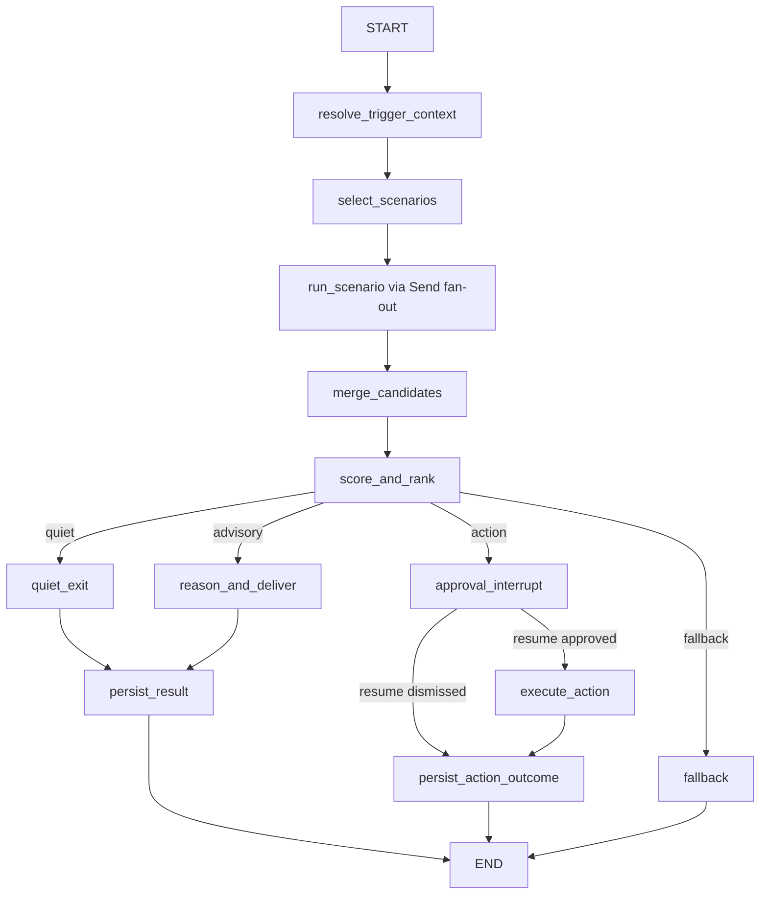

# FLEETGRAPH

Use this as the working submission document for the FleetGraph assignment.

## Current Repo Clarification

- The source PDF still mentions Claude-only integration.
- For this repo, FleetGraph should remain provider-agnostic and use OpenAI as the preferred default unless another provider is explicitly justified.

## Agent Responsibility

FleetGraph is a project-intelligence agent for Ship. Its job is to notice meaningful project-state drift, summarize context that is otherwise scattered across Ship, and make the next action obvious without pretending to be a general chatbot.

### What it monitors proactively

- Week-start drift when a week is still `planning` or has zero issues after it should be active
- Sprint-owner gaps when a planning or active week has no owner assigned
- Unassigned sprint-issue clusters when a planning or active week has too many issues without clear ownership

### What it reasons about on demand

- The current issue, sprint, project, program, or weekly-doc surface inside Ship
- Related work, ownership, history, comments, and next actions based on the current page context
- Guided next-step actions available from the current page before anything consequential is executed
- What changed recently, what is blocked, and what the user should do next without forcing them to manually traverse tabs

### What it can do autonomously

- Read Ship state through REST endpoints only
- Normalize mixed Ship relationship shapes into one internal graph state
- Score candidate findings deterministically before invoking the LLM
- Produce read-only summaries, proactive findings, and suggested next actions
- Persist dedupe, cooldown, dismiss, snooze, and trace metadata in FleetGraph-owned state

### What requires human approval

- Any consequential Ship mutation
- Starting a week
- Reassigning or changing issue state
- Posting persistent comments
- Approval or request-changes actions on Ship review surfaces

### Who it notifies and when

- Engineers and PMs for issue-level contextual help
- PMs for week-start drift, sprint-owner gaps, and unassigned sprint issues
- The current-page viewer for guided-step previews and page analysis
- The person who can actually act on the surfaced problem, rather than broadcasting generic alerts

### How it derives project membership and role context

- From Ship REST only, using normalized canonical `document_associations`, `belongs_to`, and live legacy fields such as `project_id` and `assignee_ids`
- From workspace people and accountability data to determine role lens, manager chain, owner, and accountable user context

### How current-view context shapes on-demand behavior

- FleetGraph is embedded in `UnifiedDocumentPage`, not on a standalone chat page
- It starts from route-derived context:
  - `document_id`
  - `document_type`
  - `active_tab`
  - `nested_path`
  - optional `project_context_id`
- It varies the fetch fan-out and answer style by current surface:
  - issue page -> issue detail, history, iterations, comments, related work
  - week page -> week detail, issues, standups, review, scope changes
  - project page -> project detail, issues, weeks, retro, activity
  - program page -> program plus related projects and weeks

## Graph Diagram

### Node types

- Context nodes:
  - `resolve_trigger_context`
- Scenario-selection nodes:
  - `select_scenarios`
  - `run_scenario`
- Current scenario families:
  - `week_start_drift`
  - `sprint_no_owner`
  - `unassigned_sprint_issues`
  - `entry_context_check`
  - `entry_requested_action`
  - `finding_action_review`
- Merge/rank nodes:
  - `merge_candidates`
  - `score_and_rank`
- Delivery nodes:
  - `quiet_exit`
  - `reason_and_deliver`
- Human gate and action nodes:
  - `approval_interrupt`
  - `execute_action`
  - `persist_action_outcome`
- Output and persistence nodes:
  - `persist_result`
- Failure node:
  - `fallback`

### Edges

- `resolve_trigger_context -> select_scenarios`
- `select_scenarios -> run_scenario` uses LangGraph `Send` fan-out for the chosen scenario family
- `run_scenario -> merge_candidates -> score_and_rank`
- `score_and_rank -> quiet_exit -> persist_result` when no candidate survives thresholds
- `score_and_rank -> reason_and_deliver -> persist_result` for read-only/advisory output
- `score_and_rank -> approval_interrupt` for consequential actions
- `approval_interrupt -> execute_action -> persist_action_outcome` only after explicit `resume(approved)`
- `approval_interrupt -> persist_action_outcome` when the human dismisses the action
- any unrecoverable graph-side failure -> `fallback`

### Branching conditions

- `quiet`: scenario fan-out produced no candidate with a positive score
- `reasoned`: a scenario produced advisory output that can be surfaced without a mutation
- `approval_required`: a scenario produced a consequential action and the graph paused in `approval_interrupt`
- `fallback`: the graph could not safely continue because required evidence or execution preconditions failed

## Use Cases

Minimum: 5.

| # | Role | Trigger | Agent Detects / Produces | Human Decides |
|---|------|---------|---------------------------|---------------|
| 1 | PM | Week start day passes and the week is still `planning` or has zero issues | Week-start drift summary with owner and missing setup details | Start the week, add scope, or intentionally leave it idle |
| 2 | PM | A planning or active week has reached its start window with no owner assigned | Sprint-owner gap summary naming the week and missing accountability | Assign an owner now, defer intentionally, or leave the week unchanged |
| 3 | PM | An active or planning week has a meaningful cluster of unassigned issues | Unassigned-issues brief with count, sprint context, and why assignment is needed | Assign work now, rebalance later, or leave the issues unassigned intentionally |
| 4 | Engineer or PM | User is on an issue, sprint, project, program, or weekly-doc page and wants FleetGraph to preview the next consequential step | Current-page guided-step preview, including the action target, visible proof on the current surface, and exact next step | Confirm, cancel, or refine the action before anything is executed |
| 5 | Engineer or PM | User opens an issue, sprint, project, program, or weekly-doc page and asks for help | Context-aware page analysis that pulls current document state, related work, history, comments, and next actions into one response | Choose the next step with less digging |

## Trigger Model

FleetGraph should use a hybrid trigger model:

1. Event-driven enqueue from high-signal Ship write routes
2. A scheduled sweep every 4 minutes for time-based and drift-based conditions

### Latency tradeoffs

- Pure polling is simpler, but it struggles to stay under the required 5-minute detection target once runtime and queueing are included
- Hybrid gives near-immediate enqueue for hot writes and bounded detection latency for drift conditions
- Event path target:
  - enqueue immediately on write
  - debounce/coalesce for 60 to 90 seconds
  - reason and deliver within about 30 to 60 seconds
  - typical total latency around 2 minutes
- Sweep path target:
  - worst-case wait under 4 minutes
  - plus 30 to 60 seconds for graph execution and delivery
  - worst-case total latency about 4.5 to 5 minutes

### Reliability tradeoffs

- Pure webhook/event-driven is not defensible because Ship does not expose a durable backend event bus today
- The existing `/events` socket is delivery plumbing for connected browsers, not a replayable worker trigger source
- Hybrid is more complex than pure polling, but it tolerates both:
  - hot change detection from route-level enqueue hooks
  - time-based drift detection from scheduled sweeps

### Cost tradeoffs

- Hybrid keeps clean sweeps mostly deterministic and only invokes the LLM for candidate-producing runs
- Public-API sweep cost scales with workspace count, so the worker must narrow or debounce work instead of invoking the model on every interval
- At higher scale, Ship API rate limits become the first real cliff, not raw LLM spend

### Why this model is defensible for Ship

- It reuses real Ship write touchpoints in:
  - `api/src/routes/issues.ts`
  - `api/src/routes/weeks.ts`
  - `api/src/routes/projects.ts`
  - `api/src/routes/documents.ts`
- It stays honest to the current architecture by not pretending `/events` is a durable queue
- It meets the under-5-minute detection target better than pure polling
- It supports both proactive drift detection and same-origin contextual entry on one shared graph

## Test Cases

This table matches the implemented scenario selection and the shared-trace evidence we actually have today. Where a public LangSmith URL has not been captured yet, the gap is stated explicitly instead of being replaced with a non-trace proof link.

| # | Ship State | Expected Output | Trace Link |
|---|------------|-----------------|------------|
| 1 | A scheduled sweep finds the earliest non-completed week whose calculated start date has passed and that week is still `planning`, or has reached its start window with `issue_count = 0`. | A persisted `week_start_drift` finding titled `Week start drift: ...`, with evidence about the passed start date, week state, and current owner state, plus a human-gated `Start week` action. | [worker proactive trace](https://smith.langchain.com/public/d5f1a274-6f81-4c42-b8be-924791429323/r) |
| 2 | A scheduled sweep finds the earliest `planning` or `active` week whose calculated start date has passed and `owner === null`. | A persisted `sprint_no_owner` finding titled `Sprint owner gap: ...`, with accountability evidence and a human-gated `Assign sprint owner` action. | No public shared LangSmith trace has been captured yet for a `sprint_no_owner` run. |
| 3 | A scheduled sweep finds an eligible `active` or `planning` week whose calculated start date has passed and at least 3 sprint issues have `assignee_id === null`. | A persisted `unassigned_sprint_issues` finding titled `{n} unassigned issues in ...`, with count/context evidence and advisory `Assign sprint issues` guidance for a human follow-up decision. | No public shared LangSmith trace has been captured yet for an `unassigned_sprint_issues` run. |
| 4 | `POST /api/fleetgraph/entry` runs from a current document surface with `mode: on_demand`, document context present, and a validated `requestedAction` in the draft payload. | An `approval_required` preview on the entry thread, showing the requested action title, summary, evidence, and `Apply` / `Dismiss` / `Snooze` choices before any Ship mutation runs. | [approval-preview trace](https://smith.langchain.com/public/e969f90a-ef5a-45e5-bded-9d6de7233311/r) |
| 5 | `POST /api/fleetgraph/entry` runs from a current document surface with `mode: on_demand`, document context present, and no `requestedAction`. | An `on_demand_analysis` run that fetches the document plus one-hop children, reasons over current page state, returns narrative analysis plus structured findings, and can request deeper context for follow-up turns. | No public shared LangSmith trace has been captured yet for the FAB/current-page analysis handoff. |

## Tuesday MVP Evidence

- Public demo URL: `https://ship-demo-production.up.railway.app`
- Public demo readiness: authenticated FleetGraph readiness returned HTTP `200` during the final evidence capture on `2026-03-17T12:36:53Z`
- Demo inspection guide: `docs/guides/fleetgraph-demo-inspection.md`
- Evidence bundle: `docs/evidence/fleetgraph-mvp-evidence.json` and `docs/evidence/fleetgraph-mvp-evidence.md`
- Named public demo inspection targets:
  - `FleetGraph Demo Week - Review and Apply`
  - `FleetGraph Demo Week - Owner Gap`
  - `FleetGraph Demo Week - Unassigned Issues`
  - `FleetGraph Demo Week - Validation Ready`
  - `FleetGraph Demo Week - Worker Generated`
- Stable public-demo proof lanes during the March 22, 2026 audit:
  - `FleetGraph Demo Week - Review and Apply`
  - `FleetGraph Demo Week - Owner Gap`
  - `FleetGraph Demo Week - Validation Ready`
  - `FleetGraph Demo Week - Worker Generated`
- Known public-demo blocker:
  - `FleetGraph Demo Week - Unassigned Issues` is seeded in repo but blocked on the current public Railway findings feed, so the evidence bundle records that lane as implemented but not currently publicly inspectable on Railway
- Screenshot artifacts:
  - `docs/evidence/screenshots/fleetgraph-review-apply-live.png`
  - `docs/evidence/screenshots/fleetgraph-approval-preview-live.png`
  - `docs/evidence/screenshots/fleetgraph-worker-generated-live.png`
- Shared trace links showing different execution paths:
  - Proactive worker advisory path: [worker trace](https://smith.langchain.com/public/d5f1a274-6f81-4c42-b8be-924791429323/r)
  - On-demand guided-step path: [approval-preview trace](https://smith.langchain.com/public/e969f90a-ef5a-45e5-bded-9d6de7233311/r)

- Tuesday MVP slice shipped:
  - one proactive week-start drift detection wired end to end
  - one human-confirmed `start week` gate routed through Ship REST
  - one proactive unassigned-sprint-issues lane with advisory-only next-step guidance
  - one current-page review-tab validation lane with visible page-state proof
  - real Ship data on the public Railway deployment
  - visible Ship UI proof for the seeded review/apply lane, the owner-gap lane, the validation-ready review lane, and the worker-generated proactive lane
  - a seeded but currently blocked public Railway proof lane for unassigned-sprint issues, recorded explicitly in the evidence bundle instead of being treated as already visible

## Architecture Decisions

### Framework choice

FleetGraph is built as a LangGraph workflow inside the Ship API, not as a single prompt handler or an ad hoc queue processor. The implementation in `api/src/services/fleetgraph/graph/runtime.ts` uses `StateGraph`, `Send`, `interrupt`, and `task()` to model the real execution paths we already need: proactive sweeps, on-demand page analysis, approval-gated actions, and resumable review flows. That choice fits the code better than a plain service class because FleetGraph has real branching, resumability, and checkpoint inspection requirements.

We kept the model layer behind a provider-agnostic adapter and wrapped it with LangSmith tracing, but the core decision is that LangGraph owns workflow orchestration while the worker queue stays outside the graph. The tradeoff is extra runtime complexity compared with a simpler request-response controller, but the benefit is that the graph shape, traces, interrupts, and checkpoint history all line up with how FleetGraph actually behaves in production.

### Node design rationale

The node layout is intentionally split by responsibility. `select_scenarios` and `run_scenario` handle deterministic candidate generation first, which lets proactive runs check week-start drift, missing sprint owners, and unassigned issues before spending tokens on deeper reasoning. From there, `score_and_rank`, `fetch_medium`, `reason`, and `fetch_deep` form the analysis lane, while `approval_interrupt`, `execute_action`, and `persist_action_outcome` form the action lane.

This is more verbose than a single "analyze and act" node, but it buys us three things the code needs today. First, the graph can distinguish quiet, advisory, fallback, and approval-required outcomes explicitly. Second, expensive model work is scoped to branches that produced a real candidate instead of every sweep. Third, side effects stay isolated behind explicit nodes and `task()` boundaries, which makes resume and replay behavior safer when the graph is interrupted for human review.

### State management approach

FleetGraph uses layered state instead of forcing every concern into one store. Run-local orchestration state lives in the LangGraph state object and is checkpointed per `thread_id`, which is what lets the runtime resume pending approvals and inspect prior graph state. `api/src/services/fleetgraph/graph/checkpointer.ts` keeps local and test runs lightweight with `MemorySaver`, but switches to `PostgresSaver` when `DATABASE_URL` is configured so deployed runs can survive process restarts.

Durable product state is stored separately by lifecycle. Proactive findings live in `fleetgraph_proactive_findings`, worker scheduling and dedupe live in the worker tables, and action/finding review records live in their own stores. The tradeoff is that FleetGraph has more than one persistence surface to reason about, but the separation keeps each table honest about its job: checkpoints are for workflow recovery, findings are for user-visible status, and queue tables are for worker coordination and cooldown control.

### Deployment model

FleetGraph deploys as two cooperating surfaces that share the same graph contract. The Ship API handles same-origin entry, findings, and review/apply routes, while the separate worker process handles scheduled sweeps, dirty-context enqueueing, and queued proactive execution. The worker runtime in `api/src/services/fleetgraph/worker/runtime.ts` claims due sweep schedules, dedupes jobs, runs the graph, and records checkpoint summaries, which keeps long-running or retried proactive work out of request handlers.

That split is more operationally involved than embedding everything in the API process, but it matches the actual trigger model and keeps proactive detection reliable. The deployment config also makes the separation explicit: production requires `FLEETGRAPH_ENTRY_ENABLED` for the API surface, `FLEETGRAPH_WORKER_ENABLED` plus `FLEETGRAPH_API_TOKEN` for the worker surface, `FLEETGRAPH_SERVICE_TOKEN` for service-auth checks, and LangSmith tracing for readiness proof. In practice, that gives FleetGraph a same-origin user entry point with a separately operable background lane instead of pretending one process can do both jobs well.

## Cost Analysis

### Development and Testing Costs

| Item | Amount |
|------|--------|
| OpenAI API - input tokens | about 5,386 input tokens in the captured Tuesday evidence window |
| OpenAI API - output tokens | about 924 output tokens in the captured Tuesday evidence window |
| Total invocations during development | 9 `fleetgraph.llm.generate` invocations in the captured Tuesday evidence window |
| Total development spend | about $0.0032 on `gpt-5-mini` pricing for the captured Tuesday evidence window |

Observed live trace totals for the Tuesday evidence window (`2026-03-17T12:02:20Z` to `2026-03-17T12:32:47Z`):

- `fleetgraph.runtime` root traces: 13
- `fleetgraph.llm.generate` child invocations: 9
- Total tokens recorded on child runs: 6,310
- Average tokens per `fleetgraph.llm.generate` invocation: about 701
- Public worker trace proof: the shared proactive trace records a single `fleetgraph.llm.generate` span with 552 total tokens on `gpt-5-mini`
- Trace limitation: the public LangSmith run payload exposes `outputs.total_tokens`, but not populated `prompt_tokens`, `completion_tokens`, or `total_cost` fields for these runs, so the input/output split above is estimated from the same FleetGraph proactive/on-demand prompt mix used elsewhere in this workbook

### Production Cost Projections

| Users | Monthly Cost |
|-------|--------------|
| 100 | about $2.34 |
| 1,000 | about $23.43 |
| 10,000 | about $234.27 |

Assumptions:
- Preferred default provider: OpenAI
- Preferred default model: `gpt-5-mini`
- Proactive runs per project per day: about 6 after debounce and thresholding
- On-demand invocations per user per day: about 0.7
- Active project assumption: about 1 project per 4 users
- Average tokens per invocation: about 701 based on the LangSmith Tuesday evidence window
- Cost per run: about $0.000355 using `gpt-5-mini` pricing and the same estimated 85.4% input / 14.6% output token mix
- Estimated runs per day:
  - 100 users: about 220
  - 1,000 users: about 2,200
  - 10,000 users: about 22,000
- Clean sweeps stay deterministic and are not counted as LLM invocations
