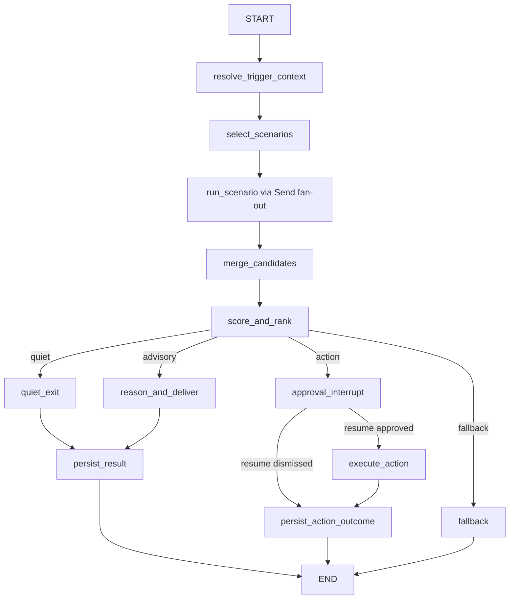

# FLEETGRAPH

Use this as the working submission document for the FleetGraph assignment.

## Current Repo Clarification

- The source PDF still mentions Claude-only integration.
- For this repo, FleetGraph should remain provider-agnostic and use OpenAI as the preferred default unless another provider is explicitly justified.

## Agent Responsibility

FleetGraph is a project-intelligence agent for Ship. Its job is to notice meaningful project-state drift, summarize context that is otherwise scattered across Ship, and make the next action obvious without pretending to be a general chatbot.

### What it monitors proactively

- Week-start drift when a week is still `planning` or has zero issues after it should be active
- Missing standups for active weeks during the business day
- Approval gaps when review or plan state is stuck in `changes_requested` or unapproved for too long
- Deadline-risk signals when target dates are near and high-priority work is still open or stale
- Load imbalance when one assignee carries materially more active work than comparable teammates

### What it reasons about on demand

- The current issue, sprint, project, program, or weekly-doc surface inside Ship
- Related work, ownership, history, comments, and next actions based on the current page context
- What changed recently, what is blocked, and what the user should do next without forcing them to manually traverse tabs

### What it can do autonomously

- Read Ship state through REST endpoints only
- Normalize mixed Ship relationship shapes into one internal graph state
- Score candidate findings deterministically before invoking the LLM
- Produce read-only summaries, proactive findings, and suggested next actions
- Persist dedupe, cooldown, dismiss, snooze, and trace metadata in FleetGraph-owned state

### What requires human approval

- Any consequential Ship mutation
- Starting a week
- Reassigning or changing issue state
- Posting persistent comments
- Approval or request-changes actions on Ship review surfaces

### Who it notifies and when

- Engineers for missing standups or issue-level contextual help
- PMs for week-start drift, approval gaps, and workload imbalance
- Directors for deadline risk and cross-project escalation signals
- The person who can actually act on the surfaced problem, rather than broadcasting generic alerts

### How it derives project membership and role context

- From Ship REST only, using normalized canonical `document_associations`, `belongs_to`, and live legacy fields such as `project_id` and `assignee_ids`
- From workspace people and accountability data to determine role lens, manager chain, owner, and accountable user context

### How current-view context shapes on-demand behavior

- FleetGraph is embedded in `UnifiedDocumentPage`, not on a standalone chat page
- It starts from route-derived context:
  - `document_id`
  - `document_type`
  - `active_tab`
  - `nested_path`
  - optional `project_context_id`
- It varies the fetch fan-out and answer style by current surface:
  - issue page -> issue detail, history, iterations, comments, related work
  - week page -> week detail, issues, standups, review, scope changes
  - project page -> project detail, issues, weeks, retro, activity
  - program page -> program plus related projects and weeks

## Graph Diagram

### Node types

- Context nodes:
  - `resolve_trigger_context`
- Scenario-selection nodes:
  - `select_scenarios`
  - `run_scenario`
- Current scenario families:
  - `week_start_drift`
  - `entry_context_check`
  - `entry_requested_action`
  - `finding_action_review`
- Merge/rank nodes:
  - `merge_candidates`
  - `score_and_rank`
- Delivery nodes:
  - `quiet_exit`
  - `reason_and_deliver`
- Human gate and action nodes:
  - `approval_interrupt`
  - `execute_action`
  - `persist_action_outcome`
- Output and persistence nodes:
  - `persist_result`
- Failure node:
  - `fallback`

### Edges

- `resolve_trigger_context -> select_scenarios`
- `select_scenarios -> run_scenario` uses LangGraph `Send` fan-out for the chosen scenario family
- `run_scenario -> merge_candidates -> score_and_rank`
- `score_and_rank -> quiet_exit -> persist_result` when no candidate survives thresholds
- `score_and_rank -> reason_and_deliver -> persist_result` for read-only/advisory output
- `score_and_rank -> approval_interrupt` for consequential actions
- `approval_interrupt -> execute_action -> persist_action_outcome` only after explicit `resume(approved)`
- `approval_interrupt -> persist_action_outcome` when the human dismisses the action
- any unrecoverable graph-side failure -> `fallback`

### Branching conditions

- `quiet`: scenario fan-out produced no candidate with a positive score
- `reasoned`: a scenario produced advisory output that can be surfaced without a mutation
- `approval_required`: a scenario produced a consequential action and the graph paused in `approval_interrupt`
- `fallback`: the graph could not safely continue because required evidence or execution preconditions failed

## Use Cases

Minimum: 5.

| # | Role | Trigger | Agent Detects / Produces | Human Decides |
|---|------|---------|---------------------------|---------------|
| 1 | Engineer | Business day, active week, no standup posted by noon | Missing standup with issue count and direct link to the correct standup or week surface | Post now, snooze, or ignore |
| 2 | PM | Week start day passes and the week is still `planning` or has zero issues | Week-start drift summary with owner and missing setup details | Start the week, add scope, or intentionally leave it idle |
| 3 | PM | Plan or review is `changes_requested`, or remains unapproved for 1 business day after submission | Approval-gap summary with the exact approver and missing follow-up | Approve, request changes, or rework the document |
| 4 | Director | Project target date is within 7 days and high-priority work is still open or stale | Deadline-risk brief naming the at-risk project, stale issues, and likely impact | Escalate, rescope, or accept the risk |
| 5 | PM | One project or active week shows clear workload skew | Load-imbalance brief with overloaded assignee, lighter peers, and candidate moves | Reassign, rebalance later, or keep the current distribution |
| 6 | Engineer or PM | User opens an issue, sprint, or project page and asks a question | Context-aware answer that pulls current document state, related work, history, comments, and next actions into one response | Choose the next step with less digging |

## Trigger Model

FleetGraph should use a hybrid trigger model:

1. Event-driven enqueue from high-signal Ship write routes
2. A scheduled sweep every 4 minutes for time-based and drift-based conditions

### Latency tradeoffs

- Pure polling is simpler, but it struggles to stay under the required 5-minute detection target once runtime and queueing are included
- Hybrid gives near-immediate enqueue for hot writes and bounded detection latency for drift conditions
- Event path target:
  - enqueue immediately on write
  - debounce/coalesce for 60 to 90 seconds
  - reason and deliver within about 30 to 60 seconds
  - typical total latency around 2 minutes
- Sweep path target:
  - worst-case wait under 4 minutes
  - plus 30 to 60 seconds for graph execution and delivery
  - worst-case total latency about 4.5 to 5 minutes

### Reliability tradeoffs

- Pure webhook/event-driven is not defensible because Ship does not expose a durable backend event bus today
- The existing `/events` socket is delivery plumbing for connected browsers, not a replayable worker trigger source
- Hybrid is more complex than pure polling, but it tolerates both:
  - hot change detection from route-level enqueue hooks
  - time-based drift detection from scheduled sweeps

### Cost tradeoffs

- Hybrid keeps clean sweeps mostly deterministic and only invokes the LLM for candidate-producing runs
- Public-API sweep cost scales with workspace count, so the worker must narrow or debounce work instead of invoking the model on every interval
- At higher scale, Ship API rate limits become the first real cliff, not raw LLM spend

### Why this model is defensible for Ship

- It reuses real Ship write touchpoints in:
  - `api/src/routes/issues.ts`
  - `api/src/routes/weeks.ts`
  - `api/src/routes/projects.ts`
  - `api/src/routes/documents.ts`
- It stays honest to the current architecture by not pretending `/events` is a durable queue
- It meets the under-5-minute detection target better than pure polling
- It supports both proactive drift detection and same-origin contextual entry on one shared graph

## Test Cases

For each use case, record the triggering Ship state, the expected output, and the trace link.

| # | Ship State | Expected Output | Trace Link |
|---|------------|-----------------|------------|
| 1 | Active week, no standup posted by noon | Missing-standup insight with direct action choices | Deferred beyond Tuesday MVP; no live trace captured yet |
| 2 | Week is still `planning` or empty after it should be active | Week-start drift insight with week owner and missing setup details | Proactive worker path: [shared trace](https://smith.langchain.com/public/d5f1a274-6f81-4c42-b8be-924791429323/r). Approval-preview/HITL path: [shared trace](https://smith.langchain.com/public/e969f90a-ef5a-45e5-bded-9d6de7233311/r). |
| 3 | Review or plan is `changes_requested` or unapproved beyond the threshold | Approval-gap summary with approver and next step | Deferred beyond Tuesday MVP; no live trace captured yet |
| 4 | Target date within 7 days and high-priority work is still open or stale | Deadline-risk brief with named stale work and likely impact | Deferred beyond Tuesday MVP; no live trace captured yet |
| 5 | Work distribution is materially skewed | Load-imbalance brief with overloaded assignee and candidate rebalance options | Deferred beyond Tuesday MVP; no live trace captured yet |

## Tuesday MVP Evidence

- Public demo URL: `https://ship-demo-production.up.railway.app`
- Public demo readiness: authenticated FleetGraph readiness returned HTTP `200` during the final evidence capture on `2026-03-17T12:36:53Z`
- Demo inspection guide: `docs/guides/fleetgraph-demo-inspection.md`
- Evidence bundle: `docs/evidence/fleetgraph-mvp-evidence.json` and `docs/evidence/fleetgraph-mvp-evidence.md`
- Named public demo inspection targets:
  - `FleetGraph Demo Week - Review and Apply`
  - `FleetGraph Demo Week - Worker Generated`
- Screenshot artifacts:
  - `docs/evidence/screenshots/fleetgraph-review-apply-live.png`
  - `docs/evidence/screenshots/fleetgraph-approval-preview-live.png`
  - `docs/evidence/screenshots/fleetgraph-worker-generated-live.png`
- Shared trace links showing different execution paths:
  - Proactive worker advisory path: [worker trace](https://smith.langchain.com/public/d5f1a274-6f81-4c42-b8be-924791429323/r)
  - On-demand approval-preview path: [approval-preview trace](https://smith.langchain.com/public/e969f90a-ef5a-45e5-bded-9d6de7233311/r)

- Tuesday MVP slice shipped:
  - one proactive week-start drift detection wired end to end
  - one human-confirmed `start week` gate routed through Ship REST
  - real Ship data on the public Railway deployment
  - visible Ship UI proof for both the seeded review/apply lane and the worker-generated proactive lane

## Architecture Decisions

Cover:
- framework choice
- node design rationale
- state management approach
- deployment model
- auth approach for proactive mode
- human-in-the-loop boundaries

### Framework choice

- LangGraph for the runtime and branching model
- LangSmith from day one for traces and execution evidence
- Provider-agnostic adapter boundary with OpenAI as the preferred default in this repo
- The worker queue remains outside LangGraph; LangGraph owns workflow orchestration, not scheduling

### Node design rationale

- Deterministic scenario runners execute before branch selection so proactive sweeps do not spend tokens on obviously clean state
- Scenario fan-out uses LangGraph `Send` so multiple scenario families can run in parallel under one thread
- FleetGraph wraps side effects in LangGraph `task()` boundaries so replay/resume does not duplicate writes
- Fetch/action nodes call real Ship REST endpoints, not hidden ORM or direct DB helpers
- Branches remain explicit so traces can distinguish:
  - quiet runs
  - advisory/read-only runs
  - approval-required runs
  - fallback runs

### State management approach

- Rich run-local state lives inside the LangGraph execution and stores facts plus routing decisions, not just bookkeeping
- Durable state is limited to the pieces needed for:
  - dedupe
  - cooldowns
  - dismiss/snooze lifecycle
  - approval tracking
  - checkpoints keyed by `thread_id`
- Production checkpoint persistence should use Postgres-backed LangGraph checkpointing; tests should inject memory/custom savers

### Deployment model

- Same-origin Ship API routes for on-demand entry and approval callbacks
- A separate worker process for proactive sweeps and dirty-context queue execution
- Public demo now targets Railway through `scripts/deploy-railway-demo.sh`
- Canonical production target remains AWS-backed Ship infrastructure
- Debug support should expose checkpoint history and pending interrupts without putting those details into the primary user-facing cards

### Auth approach for proactive mode

- On-demand requests use the existing same-origin Ship session
- Proactive mode uses a dedicated Ship API token and service user
- FleetGraph runtime still reads Ship state through REST only

### Human-in-the-loop boundaries

- Any consequential Ship mutation must pause in `approval_interrupt`
- The user must confirm before `execute_action` runs
- Read-only summaries and advisory findings do not require confirmation
- Human review threads should be resumable and inspectable later through checkpoint history

## Cost Analysis

### Development and Testing Costs

| Item | Amount |
|------|--------|
| Selected LLM API - input tokens | Not exposed separately by the current LangSmith payload for this repo's FleetGraph traces |
| Selected LLM API - output tokens | Not exposed separately by the current LangSmith payload for this repo's FleetGraph traces |
| Total invocations during development | 9 `fleetgraph.llm.generate` invocations in the captured Tuesday evidence window |
| Total development spend | Not exposed by the current LangSmith/OpenAI integration on these traces |

Observed live trace totals for the Tuesday evidence window (`2026-03-17T12:02:20Z` to `2026-03-17T12:32:47Z`):

- `fleetgraph.runtime` root traces: 13
- `fleetgraph.llm.generate` child invocations: 9
- Total tokens recorded on child runs: 6,310
- Trace limitation: the current payload records `total_tokens`, but not a reliable prompt/completion token split or dollar cost field for these runs

### Production Cost Projections

| Users | Monthly Cost |
|-------|--------------|
| 100 | about $18 |
| 1,000 | about $182 |
| 10,000 | about $1,815 |

Assumptions:
- Preferred default provider: OpenAI
- Proactive runs per project per day: about 6 after debounce and thresholding
- On-demand invocations per user per day: about 0.7
- Average tokens per invocation: about 4,700 proactive, about 7,000 on-demand
- Cost per run: about $0.0024 proactive, about $0.0035 on-demand
- Estimated runs per day: scale-dependent; see presearch cost table
