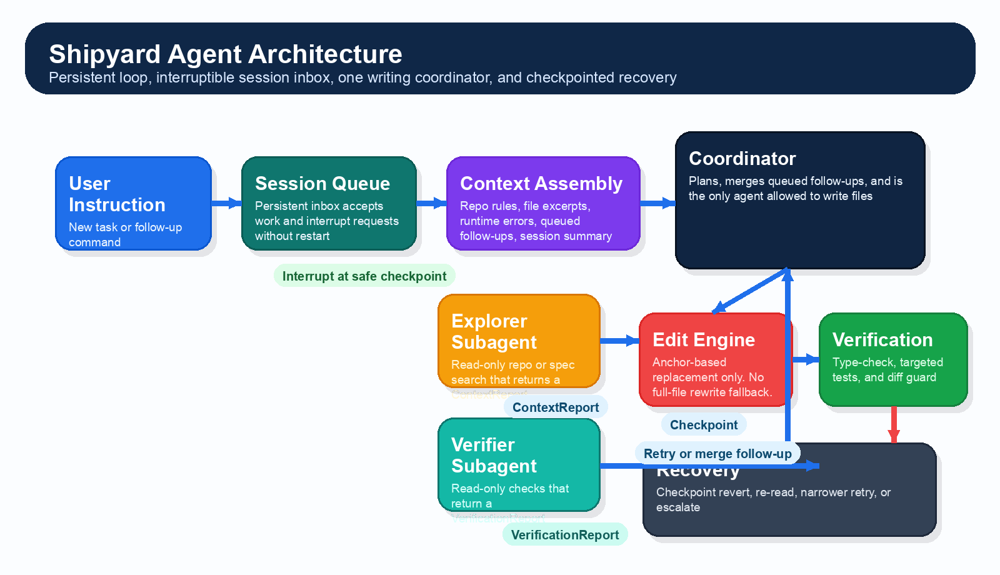
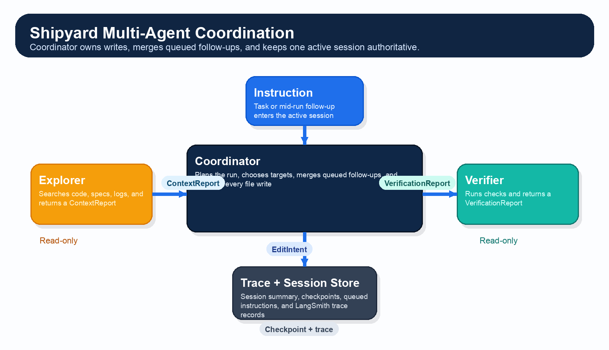

# Shipyard Pre-Search

Date: 2026-03-23

This document answers the Shipyard Pre-Search checklist directly. It is grounded in:
- the Shipyard PRD at `/Users/youss/Downloads/shipyard_prd.pdf`
- the Athena reference proposal at `/Users/youss/Downloads/athena-software-factory-proposal.docx`
- the local Ship monorepo in `/Users/youss/Development/gauntlet/ship`

## Final Recommendation

For MVP, I will build a TypeScript coding agent that:
- runs in a persistent local Node process
- keeps one durable session inbox per thread and accepts mid-run follow-up instructions without restarting
- uses Claude Sonnet 4.5 as the default model
- uses LangGraph.js for orchestration
- uses LangSmith for traces
- uses anchor-based surgical editing, not full-file rewrites
- uses one coordinator as the only writer
- uses subagents for read-only research and verification

The Athena reference influenced three decisions:
- pass small typed artifacts between stages instead of free-form agent chatter
- isolate planning, editing, and verification
- verify inside the loop instead of waiting until the end

One non-negotiable MVP behavior is operator interruptibility. If a new instruction arrives while the agent is actively working, the runtime should queue it, request a cooperative interrupt, and fold it into the same session/thread at the next safe checkpoint. The system should not require a fresh process or a brand-new thread to incorporate that new input.

## 1. For Each Agent Studied

### OpenCode

Parts studied:
- `README.md`
- `internal/llm/tools/edit.go`
- `internal/llm/tools/patch.go`
- `internal/llm/agent/agent.go`
- `internal/llm/agent/agent-tool.go`

How it handles file editing:
- Uses exact string replacement through an `edit` tool.
- Uses structured multi-file patch application through a `patch` tool.
- Rejects ambiguous matches.
- Rejects patch application when context is too fuzzy.
- Checks whether a file changed after it was last read.

How it manages context across turns:
- Auto-compacts when the conversation approaches the context window limit.
- Creates a summarized continuation session instead of failing on long conversations.

How it handles failed tool calls and unexpected output:
- Returns explicit tool errors for ambiguous edits, stale reads, bad paths, and patch parse failures.

What I would take from it:
- exact-match editing
- atomic patch application
- stale-read protection
- automatic context compaction

What I would do differently:
- keep subagents read-only at MVP
- add stronger post-edit verification
- use a simpler primary editing interface than full patch text

Verdict:
- OpenCode is the best reference for surgical text editing.

### Open SWE

Parts studied:
- `README.md`
- `agent/server.py`
- `agent/middleware/check_message_queue.py`
- `agent/middleware/tool_error_handler.py`
- `agent/middleware/open_pr.py`
- `agent/utils/agents_md.py`
- Deep Agents files for graph assembly, filesystem tools, and summarization

How it handles file editing:
- Delegates file editing to Deep Agents filesystem tools.
- Uses string-based `edit_file` and `write_file` primitives.

How it manages context across turns:
- Injects repo rules from `AGENTS.md`.
- Injects issue or thread context from the invocation surface.
- Keeps a persistent per-thread sandbox.
- Queues follow-up messages and injects them before the next model call.
- Uses summarization and prompt caching through Deep Agents middleware.

How it handles failed tool calls and unexpected output:
- Converts tool exceptions into structured tool errors instead of crashing the run.
- Uses deterministic middleware backstops like `open_pr_if_needed`.

What I would take from it:
- middleware-first orchestration
- queued follow-up message handling
- persistent workspaces
- deterministic safety nets around the model

What I would do differently:
- keep MVP local, not cloud-sandboxed
- keep one writing agent
- tighten edit verification beyond plain replace-string tools

Verdict:
- Open SWE is the best reference for orchestration, runtime flow, and multi-agent structure.

### Claude Code

Parts studied:
- "How Claude Code works"
- "How Claude remembers your project"
- "Create custom subagents"

How it handles file editing:
- The public docs focus on checkpoints and permissions more than on the exact edit primitive.
- The important operational pattern is checkpointing before edits and allowing safe undo.

How it manages context across turns:
- Uses `CLAUDE.md` for persistent project instructions.
- Uses auto memory for learned preferences and corrections.
- Compacts context automatically when sessions get long.
- Uses isolated subagent contexts that return summaries.

How it handles failed tool calls and unexpected output:
- Uses permission modes to limit autonomous actions.
- Background subagents fail closed on unapproved permissions.
- Session edits can be undone via checkpoints.

What I would take from it:
- persistent repo instructions
- checkpoints before edits
- isolated subagent contexts
- explicit permission modes

What I would do differently:
- keep the MVP smaller and more explicit
- document the edit strategy directly because the PRD grades it

Verdict:
- Claude Code is the best reference for context discipline and safety model.

## 2. Which File Editing Strategy Am I Adopting And Why

I am adopting anchor-based replacement.

Mechanism:
- read the file
- choose a unique surrounding text block as the anchor
- replace only that anchored block
- verify match count, diff size, and post-edit correctness

Why this strategy:
- simpler than AST editing
- safer than line numbers because it does not depend on drifting offsets
- easier for the model to produce reliably than perfect unified diffs
- works across TypeScript, JSON, SQL, Markdown, CSS, and config files

Why I am not choosing the others:
- unified diff is great for audit, but more formatting-fragile as the primary model interface
- line-range replacement is too brittle when files shift
- AST editing is strong but too expensive to build correctly in one week across all file types

Main failure modes:
- anchor is not unique
- file changed after read
- edit is syntactically valid but logically wrong
- edit is too large and behaves like a file rewrite

Handling:
- reject zero-match and multi-match edits
- re-read if the file hash changed
- run targeted verification after each edit
- reject oversized diffs and retry with a narrower anchor

## 3. System Diagram



Summary:
- The user instruction enters a persistent session queue.
- If a new instruction arrives during active work, it becomes a queued operator interrupt on the same session.
- The coordinator drains queued follow-ups at safe checkpoints and resumes the same thread with updated context.
- Read-only subagents can gather context or verification results in parallel.
- Only the coordinator writes files.
- Every edit goes through verification and recovery before the run is considered complete.

## 4. File Editing Strategy, Step By Step

1. Read the target file and record a content hash.
2. Identify the smallest unique anchor block around the change.
3. Confirm the anchor appears exactly once.
4. Generate a replacement only for that block.
5. Preview the diff and reject it if it is too large or touches unrelated code.
6. Apply the edit.
7. Run immediate verification:
   - syntax or type-check
   - targeted tests if relevant
   - diff guard
8. If verification passes, save the checkpoint and continue.

If the location is wrong:
- zero matches: re-read and retry with a better anchor
- multiple matches: expand the anchor and retry
- file changed: discard the old plan and rebuild from the latest file
- verification failed: revert and retry once
- repeated failure: escalate instead of thrashing

Guardrails:
- never rewrite an existing file unless the task explicitly requires it
- never edit a file that was not read in the current cycle
- never accept a change that alters too much of the file for a supposedly surgical edit

## 5. Multi-Agent Design



Orchestration model:
- one coordinator
- one explorer subagent
- one verifier subagent

Responsibilities:
- Coordinator:
  - owns the persistent loop
  - owns the session inbox and interrupt arbitration
  - owns planning
  - owns all writes
  - merges outputs
- Explorer:
  - read-only repo or spec research
  - returns a structured `ContextReport`
- Verifier:
  - read-only validation
  - returns a structured `VerificationReport`

How agents communicate:
- only through typed artifacts
- not through shared free-form memory

How outputs are merged:
- verifier evidence beats speculation
- direct file evidence beats inference
- latest file reads beat stale memory

Why this design:
- satisfies the multi-agent requirement
- avoids merge conflicts
- keeps follow-up instructions inside one authoritative session instead of spawning competing writers
- still gives real speedup through parallel research and verification

## 6. Context Injection Spec

I will inject context as a typed `ContextEnvelope`.

Context types:
- stable repo context
  - `AGENTS.md`
  - package manager and scripts
  - architecture notes
  - coding conventions
- task context
  - user instruction
  - PRD or spec excerpts
  - target paths
  - success criteria
- runtime context
  - current diff
  - tool outputs
  - failures
  - command results
  - queued follow-up instructions
- session memory
  - last summary
  - prior failed attempts
  - known blockers
  - active thread ID and last safe checkpoint

When context is injected:
- before planning
- before each edit turn
- before each repair turn
- after an operator interrupt is accepted
- before each subagent spawn
- before final verification

Rules:
- stable context is cached
- runtime context is clipped to only what matters
- file excerpts are preferred over full files
- old turns are summarized instead of replayed verbatim

## 7. Context Injection Example

```json
{
  "sessionId": "sess_123",
  "task": {
    "instruction": "Fix the failing sprint approval flow",
    "goal": "targeted fix with tests passing",
    "targetPaths": [
      "api/src/routes/weeks.ts",
      "web/src/pages/UnifiedDocumentPage.tsx"
    ]
  },
  "stableContext": {
    "repoRules": "AGENTS.md excerpt",
    "scripts": [
      "pnpm --filter @ship/api test",
      "pnpm --filter @ship/web test"
    ],
    "conventions": [
      "TypeScript",
      "pnpm workspace",
      "targeted tests only"
    ]
  },
  "runtimeContext": {
    "fileReads": [
      {
        "path": "api/src/routes/weeks.ts",
        "excerpt": "..."
      },
      {
        "path": "web/src/pages/UnifiedDocumentPage.tsx",
        "excerpt": "..."
      }
    ],
    "errors": [
      {
        "tool": "test",
        "message": "Expected 200, got 500"
      }
    ],
    "currentDiff": ""
  },
  "sessionMemory": {
    "summary": "Previous attempt touched the wrong approval branch",
    "retryCountByFile": {
      "api/src/routes/weeks.ts": 1
    }
  }
}
```

## 8. Additional Tools The Agent Will Need

- `read_file` for file reads
- `search_files` for fast symbol and content discovery
- `list_files` for path discovery
- `edit_block` for anchor-based replacement
- `write_file` for new files
- `run_command` for tests, builds, lint, and git
- `git_diff` for audit and preview
- `spawn_subagent` for explorer and verifier workers
- `enqueue_instruction` for same-session follow-ups
- `request_interrupt` for cooperative pause at the next safe checkpoint
- `checkpoint_revert` for recovery
- `trace_event` for structured tracing

## 9. What Framework Am I Using For The Agent Loop And Multi-Agent Coordination, And Why

I am using LangGraph.js with the Anthropic TypeScript SDK and LangSmith tracing.

Why:
- Ship already uses TypeScript and already has LangGraph packages in the repo.
- LangGraph gives explicit orchestration, state, and branching.
- LangGraph's checkpoints and interrupt/resume model fit the need to pause, merge operator feedback, and continue the same thread.
- It is easier to trace and explain than a custom while-loop.
- It is smaller and faster to stand up than a full Open SWE style cloud runtime.

Implementation stack:
- runtime: Node.js and TypeScript
- orchestration: LangGraph.js
- model API: Anthropic TypeScript SDK
- tracing: LangSmith
- interface: CLI REPL first, HTTP wrapper optional later
- inbox driver: thin local session queue that converts follow-up instructions into same-thread resume/update events

## 10. Where The Persistent Loop Runs And How It Is Kept Alive Between Instructions

The persistent loop will run as a long-lived local Node process inside the repo.

Behavior:
- start once with a command like `pnpm agent:dev`
- keep the process alive after each completed task
- accept new instructions through the same session without restarting
- append follow-up instructions to the active session even when a run is already in flight
- reuse the same session/thread when that new instruction is integrated

How it stays alive:
- block on the next instruction event instead of exiting
- keep active session state in memory for speed
- persist lightweight session snapshots after each turn so the process can recover if restarted
- checkpoint before and after safe interrupt boundaries so queued follow-ups can resume the same thread cleanly

Why this is enough for MVP:
- the PRD requires persistence across instructions, not distributed infrastructure
- a local long-running loop is easier to debug under time pressure

### Mid-run instruction injection

- A follow-up instruction is appended to the active session inbox, not spawned as a new session.
- The coordinator marks `interrupt_requested` and checks that flag between graph nodes, after model/tool calls, and before any new side effect.
- When the run reaches a safe checkpoint, it saves state, drains queued instructions into the session context, and re-enters the same LangGraph thread using the existing `thread_id`.
- Consequential steps already in flight are allowed to finish their atomic unit. The runtime should not hard-kill file writes, shell commands, or network mutations mid-step.
- If the graph is already waiting on a human interrupt, the queued follow-up should be treated as the next resume/edit payload for that same session instead of a fresh run.

## 11. What Is My Token Budget Per Invocation, And Where Are The Cost Cliffs

Default model:
- Claude Sonnet 4.5

Escalation model:
- Claude Opus 4.6 only for hard architectural reasoning or repeated repair failure

Reference pricing:
- Sonnet 4.5: $3 input / MTok, $15 output / MTok
- Opus 4.6: $5 input / MTok, $25 output / MTok

Working budget:
- plan or research turn: about 12k input, 1.5k output
- edit turn: about 20k input, 4k output
- repair turn: about 35k input, 6k output

Budget policy:
- keep normal turns under roughly 40k input tokens
- compact or summarize before exceeding that budget
- keep outputs tight and avoid replaying long logs

Main cost cliffs:
- full large files in prompt instead of excerpts
- full test logs instead of failing slices
- too many subagents with duplicated context
- repeated retries with the same oversized prompt
- using Opus too early

## 12. What Does The Agent Do When It Makes A Bad Edit

Detection:
- zero-match or multi-match anchor failure
- file hash mismatch after read
- syntax or type-check failure
- targeted test failure
- diff guard failure

Recovery flow:
1. stop at the failed edit
2. revert to the last checkpoint
3. re-read the file
4. rebuild the edit plan
5. retry once with a narrower anchor
6. escalate if the second attempt still fails

Important rule:
- a bad edit does not justify rewriting the whole file

## 13. What Gets Logged, And What Does A Complete Run Trace Look Like

Tracing system:
- LangSmith as the primary trace system
- local JSONL log as the fallback artifact

Every run should log:
- session ID
- instruction
- queued follow-up instructions and queue depth
- interrupt requests and the checkpoint where they were honored
- branch and git snapshot
- selected context inputs
- subagent launches and results
- model turn summaries
- tool calls and outputs
- file hashes before and after edits
- preview diffs and applied diffs
- verification commands and outputs
- retry reasons
- final outcome
- elapsed time
- token estimate and model used

A complete edit trace should show:
1. instruction received
2. session restored
3. context selected
4. optional subagent research launched
5. interrupt request recorded if a follow-up arrives mid-run
6. safe checkpoint reached and queued instruction merged into the same thread
7. edit target chosen
8. anchored edit applied
9. verification executed
10. pass or fail recorded
11. checkpoint revert and retry if needed
12. final result returned

## Final Architecture Decision

I am building:
- a TypeScript LangGraph agent
- a persistent local loop
- an interruptible session inbox that merges follow-up instructions into the active thread
- one writing coordinator
- read-only specialist subagents
- anchor-based surgical editing
- LangSmith traces

This is the best fit for the Ship repo, the Shipyard grading criteria, and the one-week timebox.

## Sources

Local sources:
- Shipyard PRD: `/Users/youss/Downloads/shipyard_prd.pdf`
- Athena reference proposal: `/Users/youss/Downloads/athena-software-factory-proposal.docx`
- [Ship AGENTS](../../../AGENTS.md)
- [Ship live context](../../CONTEXT.md)
- [Ship workflow memory](../../WORKFLOW_MEMORY.md)
- [Ship implementation strategy](../../IMPLEMENTATION_STRATEGY.md)
- [Ship root package](../../../package.json)
- [Ship API package](../../../api/package.json)
- [Ship web package](../../../web/package.json)

External primary sources:
- [OpenCode README](https://github.com/opencode-ai/opencode/blob/main/README.md)
- [OpenCode edit tool](https://github.com/opencode-ai/opencode/blob/main/internal/llm/tools/edit.go)
- [OpenCode patch tool](https://github.com/opencode-ai/opencode/blob/main/internal/llm/tools/patch.go)
- [OpenCode agent loop](https://github.com/opencode-ai/opencode/blob/main/internal/llm/agent/agent.go)
- [Open SWE README](https://github.com/langchain-ai/open-swe/blob/main/README.md)
- [Open SWE server](https://github.com/langchain-ai/open-swe/blob/main/agent/server.py)
- [Open SWE queued-message middleware](https://github.com/langchain-ai/open-swe/blob/main/agent/middleware/check_message_queue.py)
- [Open SWE tool error middleware](https://github.com/langchain-ai/open-swe/blob/main/agent/middleware/tool_error_handler.py)
- [Open SWE PR middleware](https://github.com/langchain-ai/open-swe/blob/main/agent/middleware/open_pr.py)
- [Deep Agents README](https://github.com/langchain-ai/deepagents/blob/main/README.md)
- [Deep Agents graph assembly](https://github.com/langchain-ai/deepagents/blob/main/libs/deepagents/deepagents/graph.py)
- [Deep Agents filesystem middleware](https://github.com/langchain-ai/deepagents/blob/main/libs/deepagents/deepagents/middleware/filesystem.py)
- [Deep Agents summarization middleware](https://github.com/langchain-ai/deepagents/blob/main/libs/deepagents/deepagents/middleware/summarization.py)
- [LangGraph JS interrupts](https://docs.langchain.com/oss/javascript/langgraph/interrupts)
- [LangGraph JS persistence](https://docs.langchain.com/oss/javascript/langgraph/persistence)
- [How Claude Code works](https://code.claude.com/docs/en/how-claude-code-works)
- [How Claude remembers your project](https://code.claude.com/docs/en/memory)
- [Create custom subagents](https://code.claude.com/docs/en/sub-agents)
- [Anthropic pricing](https://claude.com/pricing)
