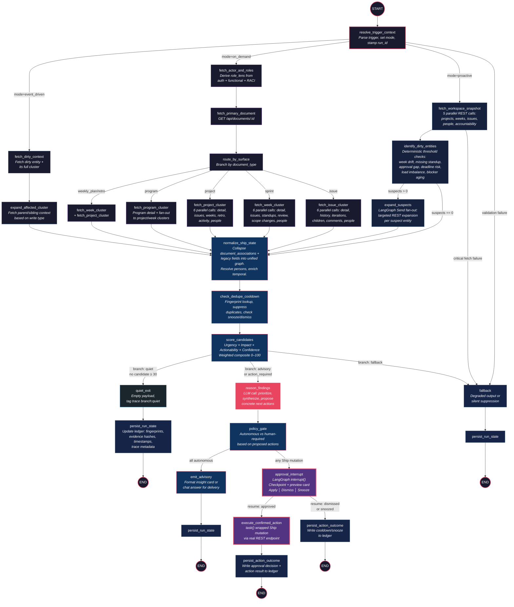

# FleetGraph Lane Graph Architecture

## Design Philosophy

The existing FLEETGRAPH.md proposes a linear graph with a scenario-based `Send` fan-out. The PRESEARCH.md decomposes that into 16 distinct nodes with parallel fetch clusters. This architecture reconciles both documents into a **three-lane graph** — a design where three execution lanes share a common state object but diverge at the first routing decision and only reconverge at scoring. This eliminates the awkward "select_scenarios then fan-out" indirection from the original graph and replaces it with explicit, traceable lanes that LangSmith can distinguish at a glance.

The three lanes are:

1. **Proactive Sweep Lane** — background worker detects drift, risk, and accountability gaps across an entire workspace
2. **On-Demand Context Lane** — user opens a Ship page and asks a question; the graph fetches the relevant document cluster and reasons over it
3. **Event-Driven Enqueue Lane** — a Ship write (issue update, week start, approval action) triggers targeted re-evaluation of the affected entities

All three lanes share the same downstream pipeline: normalize → score → branch → deliver.

---

## Top-Level Graph Topology

```
                        ┌─────────────────────┐
                        │     ENTRY GATE       │
                        │  resolve_trigger_ctx  │
                        └─────┬───────┬────────┘
                              │       │        │
                 mode=proactive│  mode=│on_demand  mode=event
                              │       │        │
              ┌───────────────▼─┐  ┌──▼────────────┐  ┌──▼─────────────────┐
              │  PROACTIVE LANE  │  │ ON-DEMAND LANE │  │ EVENT-DRIVEN LANE  │
              │                  │  │                │  │                    │
              │ fetch_workspace  │  │ fetch_primary  │  │ fetch_dirty_ctx    │
              │ _snapshot        │  │ _document      │  │                    │
              │       │          │  │       │        │  │       │            │
              │ identify_dirty   │  │ route_by       │  │ expand_affected    │
              │ _entities        │  │ _surface       │  │ _cluster           │
              │       │          │  │       │        │  │                    │
              │ expand_suspects  │  │ fetch_*_cluster │  │                    │
              │ (conditional)    │  │ (parallel)     │  │                    │
              └───────┬──────────┘  └───────┬────────┘  └──────┬─────────────┘
                      │                     │                  │
                      └─────────┬───────────┘──────────────────┘
                                │
                   ┌────────────▼────────────┐
                   │   SHARED PIPELINE        │
                   │                          │
                   │   normalize_ship_state   │
                   │          │               │
                   │   check_dedupe_cooldown  │
                   │          │               │
                   │   score_candidates       │
                   │          │               │
                   │   ┌──────┴──────┐        │
                   │   │  BRANCH     │        │
                   │   └──┬───┬───┬──┘        │
                   │  quiet│ adv│ act│ fallback│
                   └───┬───┴───┴───┴──────────┘
                       │
          ┌────────────┴──────────┬──────────────┬────────────┐
          ▼                       ▼              ▼             ▼
    quiet_exit            reason_findings   approval_interrupt  fallback
          │                       │              │              │
    persist_run_state      emit_advisory    ┌────┴────┐    persist_run_state
          │                       │         │         │         │
         END               persist_run_state  resume   resume   END
                                  │        (approved) (dismissed)
                                 END          │         │
                                        execute_action  persist_action_outcome
                                              │         │
                                        persist_action   END
                                        _outcome
                                              │
                                             END
```

---

## State Schema

Every node reads from and writes to a single `FleetGraphState` object carried through the LangGraph execution. This is the run-local state — not the persistent ledger.

```typescript
interface FleetGraphState {
  // ── Entry context (set by resolve_trigger_context) ──
  run_id: string;
  mode: "proactive" | "on_demand" | "event_driven";
  trigger_type: "sweep" | "enqueue" | "user_chat";
  trigger_source: string;               // route path, cron id, or queue key
  workspace_id: string;
  actor_id: string | null;              // null for proactive sweeps
  viewer_user_id: string | null;        // the human who will see results

  // ── Surface context (on-demand and event-driven only) ──
  document_id: string | null;
  document_type: "issue" | "sprint" | "project" | "program" | "weekly_plan" | "weekly_retro" | null;
  active_tab: string | null;
  nested_path: string | null;
  project_context_id: string | null;    // inherited from CurrentDocumentContext
  user_question: string | null;         // on-demand only

  // ── Event context (event-driven only) ──
  dirty_entity_id: string | null;
  dirty_entity_type: string | null;
  dirty_write_type: string | null;      // e.g. "issue.state_change", "week.start"
  dirty_coalesced_ids: string[];        // other dirty entities merged in debounce window

  // ── Raw fetch payloads ──
  raw_projects: ShipProject[];
  raw_weeks: ShipWeek[];
  raw_issues: ShipIssue[];
  raw_people: ShipPerson[];
  raw_accountability_items: ShipAccountabilityItem[];
  raw_primary_document: ShipDocument | null;
  raw_issue_cluster: IssueCluster | null;
  raw_week_cluster: WeekCluster | null;
  raw_project_cluster: ProjectCluster | null;
  raw_program_cluster: ProgramCluster | null;

  // ── Actor context ──
  actor_profile: ActorProfile | null;
  role_lens: "director" | "pm" | "engineer" | "unknown";
  role_derivation_stack: RoleSignal[];  // auth, functional, RACI, manager chain

  // ── Normalized graph ──
  normalized_context: NormalizedShipGraph | null;

  // ── Dedupe pre-check ──
  dedupe_hits: DedupeHit[];             // findings already active and within cooldown
  suppressed_fingerprints: string[];

  // ── Scoring ──
  candidate_findings: CandidateFinding[];
  scored_findings: ScoredFinding[];

  // ── Branch decision ──
  branch: "quiet" | "advisory" | "action_required" | "fallback";

  // ── Reasoning (only populated when branch != quiet) ──
  reasoned_findings: ReasonedFinding[] | null;
  proposed_actions: ProposedAction[];

  // ── HITL state ──
  pending_approval: PendingApproval | null;
  approval_decision: "approved" | "dismissed" | "snoozed" | null;
  action_result: ActionResult | null;

  // ── Output ──
  response_payload: ResponsePayload | null;

  // ── Error tracking ──
  partial_data: boolean;
  fetch_errors: FetchError[];
  fallback_reason: string | null;

  // ── Trace metadata ──
  trace_metadata: TraceMetadata;
}
```

---

## Node-by-Node Specification

### 1. `resolve_trigger_context`

**Lane:** Shared entry (all three lanes start here)
**Type:** Deterministic router
**LLM:** No

| Reads | Writes |
|-------|--------|
| Raw invocation payload (trigger type, workspace id, actor id, document id, route metadata, queue payload) | `run_id`, `mode`, `trigger_type`, `trigger_source`, `workspace_id`, `actor_id`, `viewer_user_id`, `document_id`, `document_type`, `active_tab`, `nested_path`, `project_context_id`, `user_question`, `dirty_entity_id`, `dirty_entity_type`, `dirty_write_type`, `dirty_coalesced_ids`, `trace_metadata` |

**Logic:**

1. Parse the invocation envelope to determine `mode`:
   - If `trigger_type == "sweep"` → `mode = "proactive"`
   - If `trigger_type == "user_chat"` → `mode = "on_demand"`
   - If `trigger_type == "enqueue"` → `mode = "event_driven"`
2. For on-demand: extract `document_id`, `document_type`, `active_tab`, `nested_path`, `project_context_id` from the frontend context injection
3. For event-driven: extract `dirty_entity_id`, `dirty_entity_type`, `dirty_write_type`, and any `dirty_coalesced_ids` from the queue payload
4. Stamp `run_id` (UUID v4) and build initial `trace_metadata` with `workspace_id`, `trigger_type`, `trigger_source`, `mode`
5. Validate that minimum required fields are present; if not, set `branch = "fallback"` and `fallback_reason`

**Outgoing edges:**

| Condition | Target |
|-----------|--------|
| `mode == "proactive"` | `fetch_workspace_snapshot` |
| `mode == "on_demand"` | `fetch_actor_and_roles` → `fetch_primary_document` (sequential) |
| `mode == "event_driven"` | `fetch_dirty_context` |
| validation failure | `fallback` |

---

### 2. `fetch_workspace_snapshot` (Proactive Lane)

**Lane:** Proactive
**Type:** Parallel REST fan-out
**LLM:** No

| Reads | Writes |
|-------|--------|
| `workspace_id` | `raw_projects`, `raw_weeks`, `raw_issues`, `raw_people`, `raw_accountability_items`, `partial_data`, `fetch_errors` |

**Parallel calls (all fire simultaneously):**

| Call | Endpoint | Cache TTL |
|------|----------|-----------|
| projects | `GET /api/projects` | 2 min |
| weeks | `GET /api/weeks` | 1–2 min |
| issues | `GET /api/issues` | 30–60 sec |
| people | `GET /api/team/people` | 10–15 min |
| accountability | `GET /api/accountability/action-items` | 30–60 sec |

**Error handling:**
- If any single call fails after 2 retries with jitter, mark `partial_data = true` and append to `fetch_errors`
- If `projects` or `weeks` fail (the two essential proactive signals), route to `fallback` instead of continuing
- If only `people` fails, fall back to ownership fields embedded in project/week/issue documents

**Outgoing edge:** `identify_dirty_entities`

---

### 3. `identify_dirty_entities` (Proactive Lane)

**Lane:** Proactive
**Type:** Deterministic filter
**LLM:** No

| Reads | Writes |
|-------|--------|
| `raw_projects`, `raw_weeks`, `raw_issues`, `raw_people`, `raw_accountability_items` | Internal `suspect_entities[]` attached to state for the next node |

**Logic:** Apply the deterministic threshold checks from the presearch without calling any LLM. This is the rule-gating layer that keeps clean sweeps token-free.

| Check | Rule | Suspect entity produced |
|-------|------|------------------------|
| Week-start drift | Week `status == "planning"` AND `sprint_start_date` has passed with 4-hour grace | `{ type: "week_start_drift", entity_id: week.id, owner_id: week.owner_id }` |
| Empty active week | Week `status == "active"` AND issue count == 0 after grace window | `{ type: "empty_active_week", entity_id: week.id }` |
| Missing standup | Business day, active week, assignee has ≥ 1 active issue, no standup posted by local noon | `{ type: "missing_standup", entity_id: person.id, week_id }` |
| Approval gap | Plan/review `changes_requested` immediately, or unapproved > 1 business day after submission | `{ type: "approval_gap", entity_id: week.id or project.id, approver_id }` |
| Deadline risk | Project `target_date` within 7 days AND (≥ 3 open issues OR any urgent/high issue stale > 48h) | `{ type: "deadline_risk", entity_id: project.id }` |
| Workload imbalance | ≥ 3 active assignees AND one person > 50% of open estimate OR > 2× median load | `{ type: "workload_imbalance", entity_id: person.id, project_id }` |
| Blocker aging | Same issue reports blocker text in 2 consecutive iterations OR blocker proxy + no update 3 business days | `{ type: "blocker_aging", entity_id: issue.id }` |

**Outgoing edges:**

| Condition | Target |
|-----------|--------|
| `suspect_entities.length == 0` | `normalize_ship_state` (will score as quiet) |
| `suspect_entities.length > 0` | `expand_suspects` |

---

### 4. `expand_suspects` (Proactive Lane)

**Lane:** Proactive
**Type:** Conditional parallel REST fan-out
**LLM:** No

| Reads | Writes |
|-------|--------|
| `suspect_entities[]` | `raw_project_cluster`, `raw_week_cluster`, `raw_issue_cluster` (only for suspects) |

**Logic:** For each suspect entity, fetch the deeper cluster needed for scoring and reasoning. This is the "targeted expansion" from the presearch — we only drill in on entities that passed the threshold filter.

| Suspect type | Additional fetches |
|---|---|
| `week_start_drift`, `empty_active_week`, `approval_gap` (week) | `GET /api/weeks/:id`, `GET /api/weeks/:id/issues`, `GET /api/weeks/:id/standups`, `GET /api/weeks/:id/review`, `GET /api/weeks/:id/scope-changes` |
| `deadline_risk` | `GET /api/projects/:id`, `GET /api/projects/:id/issues`, `GET /api/activity/project/:id` |
| `workload_imbalance` | `GET /api/team/assignments`, `GET /api/team/people/:personId/sprint-metrics` |
| `blocker_aging` | `GET /api/issues/:id/iterations`, `GET /api/issues/:id/history` |
| `missing_standup` | `GET /api/weeks/:id/standups` (if not already fetched) |
| `approval_gap` (project) | `GET /api/projects/:id`, project approval status fields |

**Fan-out strategy:** Use LangGraph `Send` to dispatch parallel fetch subgraphs per suspect. Each subgraph returns its cluster into the shared state via a reducer that merges into the appropriate `raw_*_cluster` field.

**Outgoing edge:** `normalize_ship_state`

---

### 5. `fetch_actor_and_roles` (On-Demand Lane)

**Lane:** On-Demand
**Type:** REST fetch + deterministic derivation
**LLM:** No

| Reads | Writes |
|-------|--------|
| `workspace_id`, `actor_id` | `actor_profile`, `role_lens`, `role_derivation_stack`, `raw_people` |

**Calls:**
- `GET /api/workspaces/current` → workspace membership, admin status
- `GET /api/team/people` → full people list (cacheable 10–15 min)

**Role derivation stack (evaluated top to bottom, first match wins for `role_lens`):**

| Priority | Signal | Source | Lens |
|----------|--------|--------|------|
| 1 | Explicit person `role` == "Director" | `GET /api/team/people` → person doc | `director` |
| 2 | Accountable across ≥ 2 projects/programs OR workspace admin with multi-project ownership | project/program `accountable_id` cross-ref | `director` |
| 3 | Person `role` == "PM" OR owns weeks/projects OR reviews plans/retros for others | person doc + week/project `owner_id` | `pm` |
| 4 | Default: person primarily owns issues and submits standups | issue `assignee_id` cross-ref | `engineer` |
| 5 | Cannot determine | — | `unknown` |

**Outgoing edge:** `fetch_primary_document`

---

### 6. `fetch_primary_document` (On-Demand Lane)

**Lane:** On-Demand
**Type:** REST fetch
**LLM:** No

| Reads | Writes |
|-------|--------|
| `document_id` | `raw_primary_document` |

**Call:** `GET /api/documents/:id`

**Logic:** Parse the response to confirm `document_type` matches the frontend injection. If mismatched, log a warning but proceed with the server-side type.

**Outgoing edge:** `route_by_surface`

---

### 7. `route_by_surface` (On-Demand Lane)

**Lane:** On-Demand
**Type:** Deterministic router
**LLM:** No

| Reads | Writes |
|-------|--------|
| `document_type`, `active_tab`, `project_context_id` | (routing decision only) |

**Outgoing edges (mutually exclusive, parallel cluster fetch):**

| Document type | Target node |
|---|---|
| `issue` | `fetch_issue_cluster` |
| `sprint` | `fetch_week_cluster` |
| `project` | `fetch_project_cluster` |
| `program` | `fetch_program_cluster` |
| `weekly_plan` or `weekly_retro` | `fetch_week_cluster` + inherit `project_context_id` → also trigger `fetch_project_cluster` if `project_context_id` is present |

---

### 8. `fetch_issue_cluster` (On-Demand Lane)

**Lane:** On-Demand
**Type:** Parallel REST fan-out
**LLM:** No

| Reads | Writes |
|-------|--------|
| `document_id` (issue id), `document_associations` | `raw_issue_cluster` |

**Parallel calls:**

| Call | Endpoint |
|------|----------|
| Issue detail | `GET /api/issues/:id` |
| History | `GET /api/issues/:id/history` |
| Iterations | `GET /api/issues/:id/iterations` |
| Children | `GET /api/issues/:id/children` |
| Comments | `GET /api/documents/:id/comments` |
| People (if not cached) | `GET /api/team/people` |

**Outgoing edge:** `normalize_ship_state`

---

### 9. `fetch_week_cluster` (On-Demand Lane)

**Lane:** On-Demand
**Type:** Parallel REST fan-out
**LLM:** No

| Reads | Writes |
|-------|--------|
| `document_id` (week id) | `raw_week_cluster` |

**Parallel calls:**

| Call | Endpoint |
|------|----------|
| Week detail | `GET /api/weeks/:id` |
| Week issues | `GET /api/weeks/:id/issues` |
| Standups | `GET /api/weeks/:id/standups` |
| Review | `GET /api/weeks/:id/review` |
| Scope changes | `GET /api/weeks/:id/scope-changes` |
| People (if not cached) | `GET /api/team/people` |

**Outgoing edge:** `normalize_ship_state`

---

### 10. `fetch_project_cluster` (On-Demand Lane)

**Lane:** On-Demand
**Type:** Parallel REST fan-out
**LLM:** No

| Reads | Writes |
|-------|--------|
| `document_id` (project id) | `raw_project_cluster` |

**Parallel calls:**

| Call | Endpoint |
|------|----------|
| Project detail | `GET /api/projects/:id` |
| Project issues | `GET /api/projects/:id/issues` |
| Project weeks | `GET /api/projects/:id/weeks` |
| Retro | `GET /api/projects/:id/retro` |
| Activity | `GET /api/activity/project/:id` |
| People (if not cached) | `GET /api/team/people` |

**Outgoing edge:** `normalize_ship_state`

---

### 11. `fetch_program_cluster` (On-Demand Lane)

**Lane:** On-Demand
**Type:** Parallel REST fan-out
**LLM:** No

| Reads | Writes |
|-------|--------|
| `document_id` (program id) | `raw_program_cluster` |

**Calls:**
- `GET /api/programs/:id`
- Then fan out to `fetch_project_cluster` and `fetch_week_cluster` for related entities extracted from program associations

**Outgoing edge:** `normalize_ship_state`

---

### 12. `fetch_dirty_context` (Event-Driven Lane)

**Lane:** Event-Driven
**Type:** REST fetch
**LLM:** No

| Reads | Writes |
|-------|--------|
| `dirty_entity_id`, `dirty_entity_type`, `dirty_write_type`, `dirty_coalesced_ids` | `raw_primary_document`, plus the relevant `raw_*_cluster` |

**Logic:**

1. Fetch the dirty entity: `GET /api/documents/:dirty_entity_id`
2. Determine entity type and fetch its full cluster (same calls as the on-demand cluster nodes)
3. If `dirty_coalesced_ids` are present, batch-fetch those too

**Outgoing edge:** `expand_affected_cluster`

---

### 13. `expand_affected_cluster` (Event-Driven Lane)

**Lane:** Event-Driven
**Type:** Conditional parallel REST fan-out
**LLM:** No

| Reads | Writes |
|-------|--------|
| `dirty_entity_type`, `dirty_write_type`, fetched dirty entity | Additional cluster data needed for impact assessment |

**Logic:** Based on the write type, fetch the parent and sibling context needed to assess impact:

| Write type | Expansion fetches |
|---|---|
| `issue.state_change` | Parent week cluster, parent project (for deadline risk re-check) |
| `issue.reassignment` | Parent week cluster (for load re-check), people data |
| `week.start` | Week cluster (to verify the start succeeded and surface follow-ups) |
| `week.plan_submitted` | Week cluster + project cluster (to check approval gap) |
| `project.approval_action` | Project cluster (to verify and surface result) |
| `standup.created` | Week cluster (to clear any pending missing-standup finding) |

**Outgoing edge:** `normalize_ship_state`

---

### 14. `normalize_ship_state` (Shared Pipeline)

**Lane:** Shared
**Type:** Deterministic transformation
**LLM:** No

| Reads | Writes |
|-------|--------|
| All `raw_*` fields | `normalized_context` |

**Logic:**

This is the critical normalization layer identified in the presearch. Ship's relationship model is mixed-shape — canonical `document_associations` coexist with legacy `properties.project_id` and `assignee_ids`. This node collapses both into one internal graph.

1. **Association normalization:**
   - Read `document_associations` with `relationship_type` in (`parent`, `project`, `sprint`, `program`)
   - Also read legacy fields: `properties.project_id`, `properties.assignee_ids`, `belongs_to`
   - Merge into a unified adjacency structure: `entity_id → { parents, children, project, sprint, program, assignees, owner, accountable }`
   - On conflict (association says project A, legacy field says project B), prefer `document_associations` but log the divergence

2. **Person resolution:**
   - Map all `owner_id`, `accountable_id`, `assignee_id`, `consulted_ids`, `informed_ids` to resolved person records from `raw_people`
   - Attach `role`, `reports_to`, and manager chain depth

3. **Temporal enrichment:**
   - Compute `days_until_target_date` for projects
   - Compute `hours_since_last_update` for issues
   - Compute `business_days_since_submission` for approval surfaces
   - Tag business day / non-business day for the current workspace timezone

4. **Output shape:** A `NormalizedShipGraph` with typed nodes (project, week, issue, person, program) and typed edges (owns, assigned_to, belongs_to_project, belongs_to_week, accountable_for, reports_to)

**Outgoing edge:** `check_dedupe_cooldown`

---

### 15. `check_dedupe_cooldown` (Shared Pipeline)

**Lane:** Shared
**Type:** Persistent store read + deterministic filter
**LLM:** No

| Reads | Writes |
|-------|--------|
| `normalized_context`, `candidate_findings` (from identify_dirty_entities for proactive, or built from on-demand question context) | `dedupe_hits`, `suppressed_fingerprints` |

**Logic:**

1. For each potential finding, compute `insight_fingerprint = hash(finding_type + target_entity_id + severity)`
2. Look up the fingerprint in the FleetGraph persistent ledger
3. Suppress if:
   - `evidence_hash` has not changed since last notification AND cooldown has not expired
   - Finding is `snoozed_until > now`
   - Finding is `dismissed_until > now`
4. Write suppressed fingerprints to state so scoring can skip them
5. Record `dedupe_hit = true` in trace metadata for each suppressed finding

**Cooldown defaults:**
- Accountability nudges (missing standup): same day, once
- Deadline risk: every 24 hours unless severity changes
- Workload imbalance: every 48 hours unless distribution changes materially
- Approval gap: every 12 hours unless state changes
- Week-start drift: every 4 hours until resolved

**Outgoing edge:** `score_candidates`

---

### 16. `score_candidates` (Shared Pipeline)

**Lane:** Shared
**Type:** Deterministic scorer
**LLM:** No

| Reads | Writes |
|-------|--------|
| `normalized_context`, `suppressed_fingerprints`, `mode`, `user_question` | `scored_findings`, `branch` |

**Scoring dimensions (each 0–100):**

| Dimension | Weight | Signal |
|-----------|--------|--------|
| Urgency | 0.30 | Time pressure — days until deadline, hours overdue, business-day proximity |
| Impact | 0.25 | Scope of affected work — issue count, estimate sum, priority distribution |
| Actionability | 0.25 | Whether a concrete next step exists — clear owner, available write endpoint, approval path |
| Confidence | 0.20 | Data completeness — partial_data penalty, heuristic-only penalty (blockers), cache staleness |

**Composite score** = weighted sum, normalized to 0–100.

**Branch decision:**

| Condition | Branch | Description |
|-----------|--------|-------------|
| `mode == "on_demand"` AND `user_question` is present | `advisory` | Always reason for on-demand, even if no proactive findings exist |
| No candidate survives score ≥ 30 after dedupe | `quiet` | Nothing worth surfacing |
| At least one candidate ≥ 30 AND no candidate has a consequential proposed action | `advisory` | Read-only insight delivery |
| At least one candidate ≥ 30 AND at least one candidate proposes a Ship mutation | `action_required` | Needs HITL gate |
| Required data missing or scoring precondition failed | `fallback` | Degraded path |

**Outgoing edges:**

| Branch | Target |
|--------|--------|
| `quiet` | `quiet_exit` |
| `advisory` | `reason_findings` |
| `action_required` | `reason_findings` |
| `fallback` | `fallback` |

---

### 17. `quiet_exit` (Shared Pipeline — Quiet Branch)

**Lane:** Shared
**Type:** Deterministic
**LLM:** No

| Reads | Writes |
|-------|--------|
| `branch`, `trace_metadata` | `response_payload` (empty/no-op), `trace_metadata.branch = "quiet"` |

**Logic:** Produce an empty response payload. Tag the trace with `branch:quiet`. This is the fast-exit path that keeps clean sweeps cheap.

**Outgoing edge:** `persist_run_state`

---

### 18. `reason_findings` (Shared Pipeline — Advisory + Action Branches)

**Lane:** Shared
**Type:** LLM reasoning
**LLM:** **Yes** — this is the first (and often only) LLM call in the graph

| Reads | Writes |
|-------|--------|
| `scored_findings`, `normalized_context`, `role_lens`, `user_question`, `mode` | `reasoned_findings`, `proposed_actions` |

**LLM prompt structure:**

```
SYSTEM: You are FleetGraph, a project-intelligence agent for Ship.
Your job is to {summarize context | explain risk | recommend action} for a
{role_lens} who is looking at {surface description}.

CONTEXT:
{serialized normalized_context, filtered to relevant entities}

SCORED FINDINGS:
{scored_findings with scores, finding_type, target entities}

USER QUESTION (if on-demand):
{user_question}

INSTRUCTIONS:
- For each finding, produce a 1–3 sentence explanation of why the human should care right now.
- Name the specific person, entity, and deadline involved.
- Propose a concrete next action. If the action requires a Ship mutation, mark it as `requires_approval: true` and specify the exact endpoint.
- If no finding is strong enough for action, produce advisory-only output.
- Do NOT produce generic advice. Every sentence must reference a specific Ship entity.
```

**Token budget:**
- Proactive: ~4,700 tokens total (context 700 + fetch results 2,500 + reasoning 500 + action framing 300 + output 700)
- On-demand: ~7,000 tokens total (context 900 + fetch results 3,500 + reasoning 800 + action framing 800 + output 1,000)

**Output parsing:** The LLM returns structured output (JSON or tool-call format) that maps directly into `ReasonedFinding[]` and `ProposedAction[]`.

**Outgoing edge:** `policy_gate`

---

### 19. `policy_gate` (Shared Pipeline)

**Lane:** Shared
**Type:** Deterministic policy check
**LLM:** No

| Reads | Writes |
|-------|--------|
| `reasoned_findings`, `proposed_actions`, `role_lens`, `branch` | `response_payload` (for advisory), routing decision |

**Policy rules:**

| Proposed action | Policy | Route to |
|---|---|---|
| No Ship mutation proposed | Pass through | `emit_advisory` |
| Issue reassignment or state change | Human required | `approval_interrupt` |
| Week start, carryover | Human required | `approval_interrupt` |
| Plan/review approval or request-changes | Human required | `approval_interrupt` |
| Comment posting | Human required | `approval_interrupt` |
| Bulk issue operations | Human required | `approval_interrupt` |
| Summary, risk note, next-step recommendation | Autonomous | `emit_advisory` |
| FleetGraph-owned state (snooze, dismiss) | Autonomous | `emit_advisory` |

**Outgoing edges:**

| Condition | Target |
|-----------|--------|
| All proposed actions are autonomous | `emit_advisory` |
| Any proposed action requires human approval | `approval_interrupt` |

---

### 20. `emit_advisory` (Advisory Delivery)

**Lane:** Shared
**Type:** Output formatter
**LLM:** No

| Reads | Writes |
|-------|--------|
| `reasoned_findings`, `proposed_actions` (autonomous only), `role_lens`, `mode` | `response_payload` |

**Logic:**

1. Format findings into the appropriate delivery shape:
   - **Proactive insight card:** Title, 1–3 sentence body, severity badge, target person, suggested action buttons (Snooze, Dismiss, View Evidence)
   - **On-demand chat answer:** Natural language response with entity links, related context summary, and suggested next steps
2. Attach finding fingerprints for dedupe tracking
3. Set delivery target based on `role_lens` and finding type:
   - Missing standup → the engineer
   - Week-start drift, approval gap, workload imbalance → the PM / week owner
   - Deadline risk → the director / project accountable

**Outgoing edge:** `persist_run_state`

---

### 21. `approval_interrupt` (HITL Gate)

**Lane:** Shared
**Type:** LangGraph `interrupt()` — pauses execution
**LLM:** No

| Reads | Writes |
|-------|--------|
| `proposed_actions` (those requiring approval) | `pending_approval` |

**Logic:**

1. Build a `PendingApproval` object containing:
   - Proposed change description
   - Impacted Ship entity (id, name, type)
   - Exact endpoint that will be called
   - Why FleetGraph thinks it is safe
   - Rollback feasibility assessment
2. Checkpoint the graph state via LangGraph's checkpointer
3. Emit a preview card to the user via the FleetGraph panel:
   - **Apply** button → resumes with `approval_decision = "approved"`
   - **Dismiss** button → resumes with `approval_decision = "dismissed"`
   - **Snooze** button → resumes with `approval_decision = "snoozed"`, writes `snoozed_until`
   - **View Evidence** → expands the evidence pane without resuming

**Resume behavior:**

| Decision | Target |
|----------|--------|
| `approved` | `execute_confirmed_action` |
| `dismissed` | `persist_action_outcome` |
| `snoozed` | `persist_action_outcome` (with snooze metadata) |

---

### 22. `execute_confirmed_action` (Post-Approval)

**Lane:** Shared
**Type:** REST mutation (wrapped in `task()` for idempotent replay)
**LLM:** No

| Reads | Writes |
|-------|--------|
| `pending_approval`, `approval_decision` | `action_result` |

**Ship write endpoints used:**

| Action | Endpoint |
|---|---|
| Start week | `POST /api/weeks/:id/start` |
| Reassign issue | `PATCH /api/issues/:id` (body: `{ assignee_id }`) |
| Change issue state | `PATCH /api/issues/:id` (body: `{ state }`) |
| Approve plan | `POST /api/weeks/:id/approve-plan` or `POST /api/projects/:id/approve-plan` |
| Request changes | `POST /api/weeks/:id/request-plan-changes` or `POST /api/weeks/:id/request-retro-changes` |
| Approve review | `POST /api/weeks/:id/approve-review` |
| Carryover | `POST /api/weeks/:id/carryover` |
| Post comment | `POST /api/documents/:id/comments` |

**Error handling:**
- Wrap in LangGraph `task()` so replay/resume does not duplicate writes
- If the Ship endpoint returns an error, record in `action_result` and do not retry mutations automatically
- Record the response status and body for trace evidence

**Outgoing edge:** `persist_action_outcome`

---

### 23. `persist_action_outcome`

**Lane:** Shared
**Type:** Persistent store write
**LLM:** No

| Reads | Writes |
|-------|--------|
| `pending_approval`, `approval_decision`, `action_result` | FleetGraph persistent ledger |

**Writes:**
- `approval_request_id`, `decision`, `decision_at`, `action_endpoint`, `action_status`, `action_response_summary`
- If dismissed: write `dismissed_until` with cooldown
- If snoozed: write `snoozed_until` with user-selected time
- If approved and successful: write `resolved_at`

**Outgoing edge:** `END`

---

### 24. `persist_run_state` (Terminal Persistence)

**Lane:** Shared (quiet + advisory paths)
**Type:** Persistent store write
**LLM:** No

| Reads | Writes |
|-------|--------|
| `scored_findings`, `response_payload`, `dedupe_hits`, `trace_metadata` | FleetGraph persistent ledger |

**Writes:**
- For each surfaced finding: `insight_fingerprint`, `evidence_hash`, `first_seen_at`, `last_seen_at`, `last_notified_at`
- For quiet runs: update `last_seen_at` on any existing findings that were re-checked but still below threshold
- Trace metadata finalization: `branch`, `candidate_count`, `finding_types`, `dedupe_hit`, `approval_required`, `ship_api_calls`, `llm_provider`, `llm_model`

**Outgoing edge:** `END`

---

### 25. `fallback`

**Lane:** Shared
**Type:** Error handler
**LLM:** No

| Reads | Writes |
|-------|--------|
| `fetch_errors`, `fallback_reason`, `partial_data` | `response_payload` |

**Logic:**

1. If `partial_data == true` and `mode == "on_demand"`:
   - Produce a degraded answer with a disclaimer: "Some Ship data was unavailable, so this answer may be incomplete."
   - Never propose mutations from partial data
2. If `partial_data == true` and `mode == "proactive"`:
   - Suppress all proactive delivery
   - Log the failure for observability
3. If the failure is auth-related (`401` / `403`):
   - Mark workspace integration as unhealthy
   - Surface admin notification in FleetGraph UI
4. If rate-limited (`429`):
   - Back off, reduce concurrency, defer lower-priority sweeps

**Outgoing edge:** `persist_run_state` → `END`

---

## Complete Edge Table

| # | From | To | Condition |
|---|------|----|-----------|
| 1 | `resolve_trigger_context` | `fetch_workspace_snapshot` | `mode == "proactive"` |
| 2 | `resolve_trigger_context` | `fetch_actor_and_roles` | `mode == "on_demand"` |
| 3 | `resolve_trigger_context` | `fetch_dirty_context` | `mode == "event_driven"` |
| 4 | `resolve_trigger_context` | `fallback` | validation failure |
| 5 | `fetch_workspace_snapshot` | `identify_dirty_entities` | always |
| 6 | `fetch_workspace_snapshot` | `fallback` | critical fetch failure (projects or weeks) |
| 7 | `identify_dirty_entities` | `expand_suspects` | `suspect_entities.length > 0` |
| 8 | `identify_dirty_entities` | `normalize_ship_state` | `suspect_entities.length == 0` |
| 9 | `expand_suspects` | `normalize_ship_state` | always (after parallel fan-out completes) |
| 10 | `fetch_actor_and_roles` | `fetch_primary_document` | always |
| 11 | `fetch_primary_document` | `route_by_surface` | always |
| 12 | `route_by_surface` | `fetch_issue_cluster` | `document_type == "issue"` |
| 13 | `route_by_surface` | `fetch_week_cluster` | `document_type == "sprint"` |
| 14 | `route_by_surface` | `fetch_project_cluster` | `document_type == "project"` |
| 15 | `route_by_surface` | `fetch_program_cluster` | `document_type == "program"` |
| 16 | `route_by_surface` | `fetch_week_cluster` + `fetch_project_cluster` | `document_type in ("weekly_plan", "weekly_retro")` |
| 17 | `fetch_issue_cluster` | `normalize_ship_state` | always |
| 18 | `fetch_week_cluster` | `normalize_ship_state` | always |
| 19 | `fetch_project_cluster` | `normalize_ship_state` | always |
| 20 | `fetch_program_cluster` | `normalize_ship_state` | always |
| 21 | `fetch_dirty_context` | `expand_affected_cluster` | always |
| 22 | `expand_affected_cluster` | `normalize_ship_state` | always |
| 23 | `normalize_ship_state` | `check_dedupe_cooldown` | always |
| 24 | `check_dedupe_cooldown` | `score_candidates` | always |
| 25 | `score_candidates` | `quiet_exit` | `branch == "quiet"` |
| 26 | `score_candidates` | `reason_findings` | `branch in ("advisory", "action_required")` |
| 27 | `score_candidates` | `fallback` | `branch == "fallback"` |
| 28 | `quiet_exit` | `persist_run_state` | always |
| 29 | `reason_findings` | `policy_gate` | always |
| 30 | `policy_gate` | `emit_advisory` | all proposed actions are autonomous |
| 31 | `policy_gate` | `approval_interrupt` | any proposed action requires human approval |
| 32 | `emit_advisory` | `persist_run_state` | always |
| 33 | `approval_interrupt` | `execute_confirmed_action` | `resume(approved)` |
| 34 | `approval_interrupt` | `persist_action_outcome` | `resume(dismissed)` or `resume(snoozed)` |
| 35 | `execute_confirmed_action` | `persist_action_outcome` | always |
| 36 | `persist_run_state` | `END` | always |
| 37 | `persist_action_outcome` | `END` | always |
| 38 | `fallback` | `persist_run_state` | always |

---

## LangSmith Trace Signatures

Each execution path produces a visibly distinct trace shape:

### Trace 1: Clean proactive sweep (quiet)
```
resolve_trigger_context
  → fetch_workspace_snapshot [5 parallel REST calls]
    → identify_dirty_entities [0 suspects]
      → normalize_ship_state
        → check_dedupe_cooldown
          → score_candidates [branch: quiet]
            → quiet_exit
              → persist_run_state → END
```
**Expected:** 0 LLM calls, ~5 REST calls, <2s latency

### Trace 2: Proactive sweep with week-start drift detected
```
resolve_trigger_context
  → fetch_workspace_snapshot [5 parallel REST calls]
    → identify_dirty_entities [1 suspect: week_start_drift]
      → expand_suspects [5 parallel REST calls for week cluster]
        → normalize_ship_state
          → check_dedupe_cooldown [no suppression]
            → score_candidates [branch: action_required, score: 72]
              → reason_findings [1 LLM call]
                → policy_gate [action: POST /api/weeks/:id/start]
                  → approval_interrupt [PAUSED]
                    ... user clicks Apply ...
                  → execute_confirmed_action [POST /api/weeks/:id/start]
                    → persist_action_outcome → END
```
**Expected:** 1 LLM call, ~10 REST calls, human latency dominates

### Trace 3: On-demand issue page question
```
resolve_trigger_context
  → fetch_actor_and_roles [2 REST calls]
    → fetch_primary_document [1 REST call]
      → route_by_surface [issue]
        → fetch_issue_cluster [6 parallel REST calls]
          → normalize_ship_state
            → check_dedupe_cooldown
              → score_candidates [branch: advisory]
                → reason_findings [1 LLM call]
                  → policy_gate [no mutation]
                    → emit_advisory
                      → persist_run_state → END
```
**Expected:** 1 LLM call, ~9 REST calls, <5s latency

### Trace 4: Event-driven issue reassignment triggers load re-check
```
resolve_trigger_context
  → fetch_dirty_context [1 REST call for dirty entity + cluster]
    → expand_affected_cluster [parent week + people data]
      → normalize_ship_state
        → check_dedupe_cooldown
          → score_candidates [branch: advisory, workload_imbalance score: 45]
            → reason_findings [1 LLM call]
              → policy_gate [advisory only]
                → emit_advisory
                  → persist_run_state → END
```
**Expected:** 1 LLM call, ~6 REST calls, <3s after debounce

### Trace 5: Dedupe suppression
```
resolve_trigger_context
  → fetch_workspace_snapshot
    → identify_dirty_entities [1 suspect: deadline_risk]
      → expand_suspects
        → normalize_ship_state
          → check_dedupe_cooldown [suppressed: evidence unchanged, cooldown active]
            → score_candidates [branch: quiet, all candidates suppressed]
              → quiet_exit
                → persist_run_state → END
```
**Expected:** 0 LLM calls, suppression logged in trace metadata

---

## Why Three Lanes Instead of Scenario Fan-Out

The original FLEETGRAPH.md uses a `select_scenarios → Send fan-out → merge_candidates` pattern. This architecture replaces that with three explicit entry lanes for these reasons:

1. **Trace clarity.** With scenario fan-out, every trace starts identically through `resolve_trigger_context → select_scenarios` and only diverges inside opaque `Send` subgraphs. With three lanes, the trace diverges at the first edge, and LangSmith can filter and compare by lane without inspecting subgraph internals.

2. **Fetch efficiency.** The proactive lane needs a workspace-wide snapshot first, then targeted expansion. The on-demand lane needs a single document cluster. The event-driven lane needs the dirty entity plus its parent context. These are fundamentally different fetch patterns, and forcing them through a common "scenario runner" node adds unnecessary indirection.

3. **Cost isolation.** Clean proactive sweeps should never invoke the LLM. On-demand always invokes the LLM. Event-driven may or may not. Separating the lanes makes it trivial to meter and budget each path independently.

4. **The shared pipeline is still shared.** Everything from `normalize_ship_state` onward is identical across all three lanes. The reconvergence point is natural — all lanes produce raw Ship data that needs the same normalization, scoring, and delivery treatment.

5. **The scenario families are still present.** The `identify_dirty_entities` node in the proactive lane runs the same scenario checks (week_start_drift, missing_standup, approval_gap, deadline_risk, workload_imbalance, blocker_aging) as the original scenario families. They are just expressed as deterministic threshold rules inside one node rather than separate `Send` subgraphs.

---

## Mermaid Diagram


